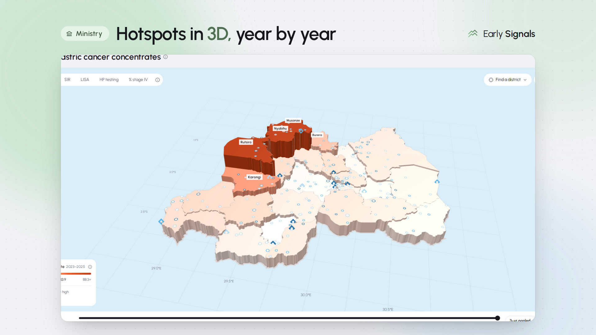
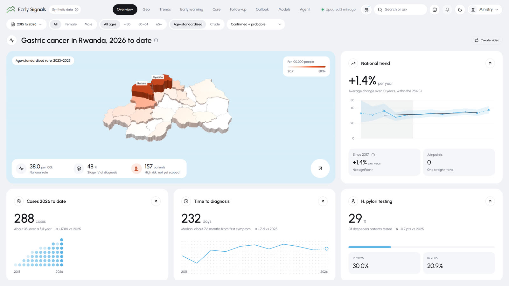
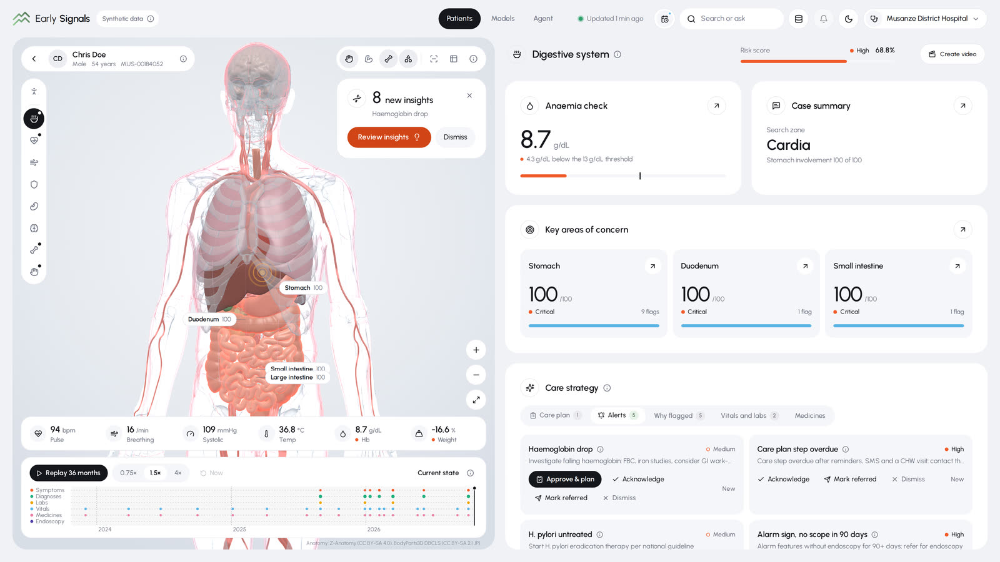
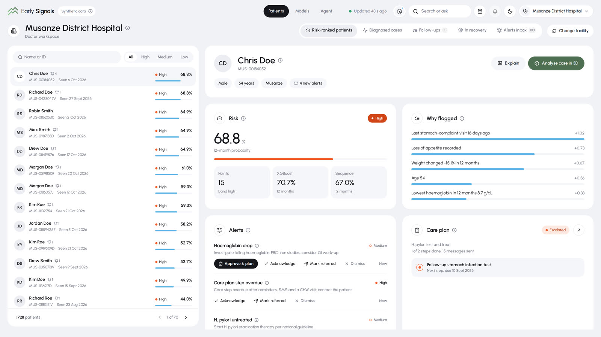
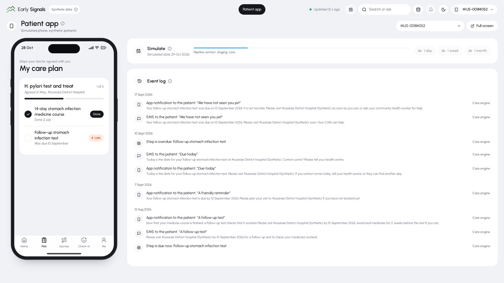
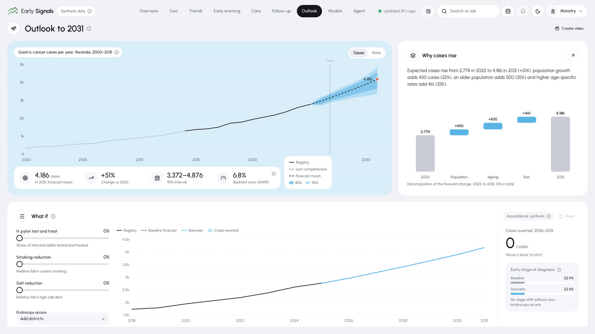
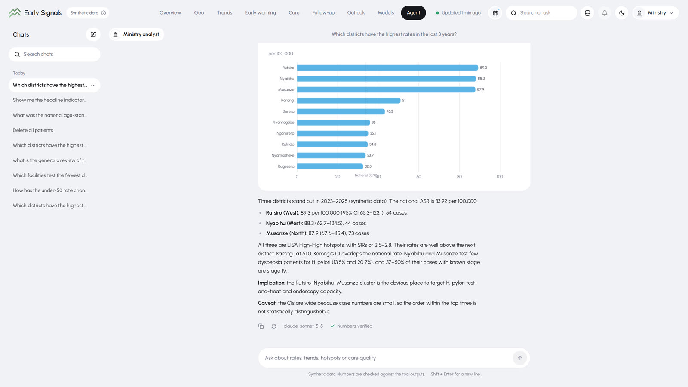

<p align="center">
  
</p>

<h1 align="center">Early Signals</h1>

<p align="center">
  <b>Catching gastric cancer before stage IV, using the clinic records Rwanda already collects.</b><br>
  Surveillance, risk flags, care coordination and an AI agent, built on a synthetic OpenMRS-style EMR.
</p>

<p align="center">
  
  
  
  
  
</p>

<p align="center">
  <a href="docs/media/sizzle.mp4">
    
  </a>
  <br>
  <a href="docs/media/sizzle.mp4"><b>▶ Watch the 39-second demo reel</b></a>
</p>

> [!IMPORTANT]
> All data in this project is **synthetic**. No real patients, facilities or district statistics appear anywhere. The
> risk models are proofs of concept and are not for clinical use.

## Background

Gastric cancer cases are rising in Rwanda, and most patients are diagnosed late, when treatment options are limited and
survival is poor. Hospitals already record diagnoses, lab results, endoscopy reports and demographics in their EMRs,
but that data is rarely analysed to see how the disease is moving through the population or who is most at risk. Key
risk factors such as *H. pylori* infection are often not tested or not recorded.

**Early Signals** shows what routine EMR data can do when it is put to work end to end. A synthetic 1.5M-person Rwandan
EMR feeds an incremental analytics pipeline and three tiers of risk models. Ministry analysts see where the burden is
growing. District doctors see who needs an endoscopy, and why. And once a doctor approves a care plan, the patient
gets a plain-language nudge on their phone, with no diagnosis words, only advice to visit.

## Features

<table>
  <tr>
    <td width="50%"></td>
    <td width="50%"></td>
  </tr>
  <tr>
    <td><b>National picture.</b> Age-standardised rates, joinpoint trends, 3D district hotspots, survival and H. pylori testing for the ministry.</td>
    <td><b>Case analysis in 3D.</b> A patient's symptoms, labs and vitals light up on an anatomical body, with a month-by-month replay.</td>
  </tr>
  <tr>
    <td></td>
    <td></td>
  </tr>
  <tr>
    <td><b>Who needs a scope, and why.</b> Risk-ranked patients for each facility, with the reasons behind every flag.</td>
    <td><b>Care plans in the patient's pocket.</b> Doctor-approved plans, reminders by app, SMS and community health worker, closed by EMR evidence.</td>
  </tr>
  <tr>
    <td></td>
    <td></td>
  </tr>
  <tr>
    <td><b>Outlook to 2031.</b> Forecasts with 80/95% bands, the drivers behind the change and what-if scenarios.</td>
    <td><b>AI agent.</b> Ask in plain language and get charts with numbers checked against the data. Also available over MCP.</td>
  </tr>
</table>

- **Surveillance**: age-standardised rates with confidence intervals, joinpoint regression, spatial clustering (LISA,
  Gi*, SIR), Kaplan–Meier survival and care-quality funnel plots.
- **Early warning**: pre-diagnostic signal curves, missed alarm symptoms, H. pylori testing gaps and diagnostic delays.
- **Three tiers of risk models**: a points score, XGBoost with SHAP reasons and a JAX sequence model, combined into an
  ensemble (AUROC 0.970 and a median lead time of 6.2 months on the synthetic test set).
- **Care coordination**: six care pathways, a reminder ladder, a patient app and a simulation clock that shows whether
  patients come back.
- **Learning loop**: a challenger model trained on verified outcomes, with gates and a human Promote button.
- **Role-scoped by design**: the ministry sees only aggregates (counts below 5 suppressed), doctors see only their
  facility, and patients see only their own record.
- **Data videos and daily briefs**: Remotion videos of a case or the national picture, and a one-page PDF brief each
  morning.

See [Architecture](docs/architecture.md) for every screen and component.

## Tech stack

| Layer | Tools |
|---|---|
| Synthetic EMR | Python 3.11, NumPy, Polars, PyArrow, OpenMRS-style MySQL schema |
| Pipeline and analytics | DuckDB (blue/green publish), statsmodels, lifelines, PySAL (libpysal, esda), SciPy |
| Machine learning | scikit-learn, XGBoost, SHAP, JAX (GRU/Transformer sequence model), APC + ETS forecasting |
| API | FastAPI, Pydantic, sqlglot (guarded NL→SQL), WebSockets |
| Dashboard | React 18, TypeScript, Vite, HeroUI, Framer Motion, ECharts, deck.gl, react-three-fiber |
| AI agent | Node 22, Hono, Vercel AI SDK, MCP (Streamable HTTP), Claude / OpenRouter / OpenAI-compatible models, Python sandbox, libSQL |
| Videos | Remotion |
| Quality | pytest, Playwright, DeepEval |
| Tooling | uv, pnpm, Make, Docker Compose, Claude Code |

## Quick start

```bash
cp .env.example .env
uv sync --extra dev --extra report
make dev-data     # small synthetic dataset, about 15 min, no MySQL needed
make serve        # dashboard http://localhost:5173, API http://localhost:8000
```

The full 1.5M-person build, demo mode and the live MySQL loop are covered in
[Getting started](docs/getting-started.md) and [Setup](docs/setup.md).

## Documentation

| | |
|---|---|
| [Getting started](docs/getting-started.md) | Run it locally |
| [Architecture](docs/architecture.md) | Components, roles, screens |
| [Care loop](docs/care-loop.md) | Care plans, patient app, forecasts, 10-step demo |
| [AI agent and MCP](docs/agent-and-mcp.md) | Agent settings and MCP connection |
| [Built with Claude Code](docs/claude-code.md) | How we built it and the repo's Claude automations |
| [Tests and results](docs/testing.md) | Test suites and verified numbers |
| [Data, privacy and licences](docs/data-and-licences.md) | Synthetic data rules and third-party licences |
| [Specification](docs/spec.md) and [decisions](docs/decisions.md) | The full spec and agreed deviations |

## Built at the Anthropic AI Week Hackathon

Early Signals was built at the **Anthropic AI Week Hackathon**.

**Team:** Benjamin, Remy, Andy and Irere.

**Built with Claude.** The code was written almost entirely by **Claude Opus 5.5** in Claude Code, with the team setting
direction and reviewing the work. Along the way we used:

- **`/goal`** for long autonomous runs against a clear finish line;
- **`/loop`** to repeat tasks such as `/validate-risk` on an interval;
- **Claude Code on the web** cloud sessions and **Routines** (a daily 07:00 Kigali report);
- **project skills** (`/validate-risk`, `/daily-report`), **hooks** and **`CLAUDE.md`**;
- **subagents**, **multi-agent workflows**, **git worktrees**, **`/fork`** and **Monitor** for parallel work;
- **MCP**, to plug the Early Signals agent into Claude Code;
- **`/brag`**, which made the demo reel from real captures of the app.

Details are in [Built with Claude Code](docs/claude-code.md).

## Licence

Code is released under the [MIT Licence](LICENSE). The 3D anatomy (Z-Anatomy / BodyParts3D, CC BY-SA) and district
boundaries (geoBoundaries, CC BY 4.0) keep their own licences; see [Data, privacy and licences](docs/data-and-licences.md).
