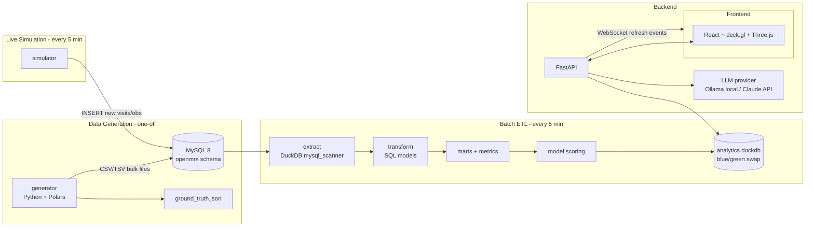
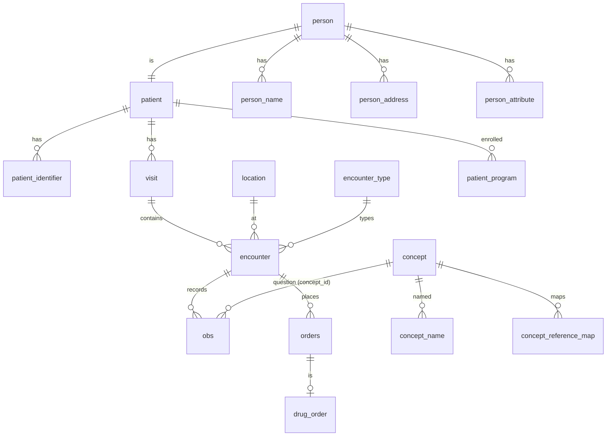

# Early Signals — Technical Specification
### Gastric Cancer Trend & Risk Intelligence Platform (Synthetic OpenMRS EMR, Rwanda)

| Field | Value |
|---|---|
| Document version | 1.1 (v1.0 + Appendix V1.1: Doctor Case Analysis 3D; deviations in `docs/decisions.md`) |
| Status | Build-ready (frozen contracts: §6, §7, §11, §14) |
| Build window | 3 days (agentic engineering) |
| Demo target | Local laptop, Docker Compose, fully offline capable |
| Data | 100% synthetic — no real patient data anywhere in the system |

> **Read this first (for humans and agents).**
> This document is the single source of truth. Every agent/workstream builds against the **contracts** in this file (schemas, table names, API shapes, config keys). If you need to change a contract, update this document first and bump the version in the table above. Sections marked **[CONTRACT]** must not be changed without team sign-off. Sections marked **[GUIDANCE]** can be adapted.

---

## Table of Contents

1. [Overview](#1-overview)
2. [System Architecture](#2-system-architecture)
3. [Repository Structure](#3-repository-structure)
4. [Technology Stack](#4-technology-stack)
5. [Geography Reference (Rwanda)](#5-geography-reference-rwanda)
6. [Source Data Model — OpenMRS-style MySQL](#6-source-data-model--openmrs-style-mysql-contract)
7. [Concept Dictionary](#7-concept-dictionary-contract)
8. [Synthetic Data Generator](#8-synthetic-data-generator)
9. [Planted Insights & Ground Truth](#9-planted-insights--ground-truth-contract)
10. [Live Simulator & ETL Pipeline](#10-live-simulator--etl-pipeline)
11. [Analytics Layer — DuckDB Schemas](#11-analytics-layer--duckdb-schemas-contract)
12. [Epidemiological Methods](#12-epidemiological-methods)
13. [Risk Models (3 Tiers)](#13-risk-models-3-tiers)
14. [Backend API](#14-backend-api-contract)
15. [AI Features](#15-ai-features)
16. [Frontend Dashboard](#16-frontend-dashboard)
17. [Infrastructure & Docker](#17-infrastructure--docker)
18. [Privacy, Ethics & Safety](#18-privacy-ethics--safety)
19. [Testing & Validation](#19-testing--validation)
20. [Agentic Workstreams & 3-Day Plan](#20-agentic-workstreams--3-day-plan)
21. [Demo Script](#21-demo-script)
22. [Risks & Mitigations](#22-risks--mitigations)
23. [Appendices](#23-appendices)

---

## 1. Overview

### 1.1 Problem Statement

Gastric cancer cases are rising in Rwanda, and most patients are diagnosed late, when treatment options are limited and survival is poor. Hospitals routinely collect electronic medical record (EMR) data — diagnoses, lab results, endoscopy reports, and demographics — but this data is rarely analysed to understand how the disease is evolving in the population or to identify who is most at risk. Key risk factors such as *H. pylori* infection are often not tested or recorded. **Early Signals** demonstrates how routine EMR data can track gastric cancer trends, surface risk indicators, flag high-risk patients earlier, and expose gaps in data recording.

### 1.2 What We Are Building (one paragraph)

A fully local platform that (1) generates a realistic **1.5M-patient synthetic OpenMRS-style EMR** for Rwanda with **planted, discoverable epidemiological insights**, (2) continuously **simulates new hospital activity** and runs a **batch ETL** every few minutes from MySQL into **DuckDB**, (3) computes **epidemiological trend metrics** (age-standardised rates, joinpoint regression, spatial clustering, survival) and **three tiers of risk models** (points score, XGBoost + SHAP, deep sequence model), and (4) serves everything through a **highly interactive React dashboard with 3D maps and visuals**, plus **AI features**: natural-language questions, AI-written insight summaries, and patient-level doctor alerts.

### 1.3 Goals (measurable)

| ID | Goal | Measure of success |
|---|---|---|
| G1 | Realistic synthetic EMR at scale | 1.5M patients, ≥50M `obs` rows, passes realism checks in §19.2 |
| G2 | Insights are discoverable | 100% of planted insights (§9) recovered by the analytics layer within tolerance |
| G3 | Live system | New data appears in the dashboard ≤ 5 min after simulation, without restart |
| G4 | Risk models beat baseline | ML AUROC > points-score AUROC; DL lead time ≥ ML lead time (§13.7) |
| G5 | Fast, impressive UX | Every dashboard interaction responds in < 1.5 s (p95) on a 16 GB laptop |
| G6 | Trustworthy AI | NL→SQL answers correct on ≥ 18/20 benchmark questions (§19.5); 0 hallucinated numbers in summaries |

### 1.4 Non-Goals

| Non-goal | Why |
|---|---|
| Using or connecting to real patient data | Ethics approvals impossible in time; synthetic is safer for a demo |
| Clinical-grade validation of models | Models are proofs of concept on synthetic data |
| Full OpenMRS application (UI, modules, REST API) | We only mirror the **database schema**; OpenMRS web app is not deployed |
| Cloud deployment, auth provider, multi-tenant | Local demo; role switch is a UI toggle only |
| Real-time streaming (Kafka) | Scheduled micro-batches are sufficient and simpler |

### 1.5 Personas & User Stories

**Persona A — Ministry / public health official ("Ministry view")**
- As a public health officer, I want to see age-standardised gastric cancer rates by district over time so that I can find where the burden is growing.
- As a public health officer, I want to see where incidence trends changed direction (joinpoints) so that I can connect changes to events (e.g. new endoscopy units).
- As a public health officer, I want to compare facilities on *H. pylori* testing and stage at diagnosis so that I can target training and equipment.
- As a public health officer, I want to ask questions in plain English so that I don't need an analyst for every question.

**Persona B — Clinician at a district hospital ("Doctor view")**
- As a doctor, I want a list of my facility's patients ranked by gastric cancer risk so that I can prioritise endoscopy referrals.
- As a doctor, I want to see *why* a patient was flagged (top reasons) so that I can trust or override the alert.
- As a doctor, I want a patient timeline (visits, Hb trend, prescriptions) so that I can spot the pattern quickly.
- As a doctor, I want to acknowledge, refer, or dismiss an alert so that the list stays useful.

**Persona C — Hackathon judge**
- As a judge, I want to see the system *discover* insights live so that I can believe the approach works on real data.

### 1.6 Scope Priorities

| Priority | Items |
|---|---|
| **P0 (must demo)** | Synthetic data + planted insights; ETL to DuckDB; ASR trends + joinpoint; 3D district map with drill-down; points score + XGBoost; patient risk card with reasons; live refresh indicator; synthetic-data banner |
| **P1 (should demo)** | Deep sequence model; NL→SQL chat; AI insight summaries; KM survival; facility funnel plot; spatial clustering (LISA); Three.js 3D surfaces |
| **P2 (if time)** | Alert workflow persistence; fairness dashboard; PDF export; model retraining button; scenario simulator ("what if H. pylori testing doubled") |

---

## 2. System Architecture

### 2.1 High-level diagram



### 2.2 Component responsibilities

| Component | Responsibility | Owner workstream |
|---|---|---|
| `generator` | Build reference data, 10 years of synthetic history, plant insights, write `ground_truth.json`, bulk-load MySQL | WS-A |
| `simulator` | Every tick, add new encounters/obs dated "now", progressing existing disease trajectories | WS-A |
| `pipeline` | Incremental extract → transform → marts → metrics → model scoring → atomic publish | WS-B |
| `ml` | Feature engineering, training, evaluation, model registry, batch scoring | WS-C |
| `api` | REST + WebSocket, NL→SQL, insight summaries, alerts | WS-D |
| `frontend` | Ministry view, Doctor view, 3D visuals, chat | WS-E |
| `infra` | Docker Compose, Makefile, seeds, demo reset | WS-F |

### 2.3 Key design decisions (ADR summary)

| # | Decision | Rationale | Trade-off |
|---|---|---|---|
| ADR-1 | MySQL mirrors OpenMRS; DuckDB for analytics | Realism for judges + columnar speed for 50M+ rows | Two stores to keep in sync |
| ADR-2 | DuckDB `mysql` extension for extract | No extra CDC tooling; SQL-only extract | Extract load on MySQL during batches |
| ADR-3 | Blue/green DuckDB file swap | DuckDB allows one writer; API reads a stable file while the pipeline builds the next one | 2× disk for the analytics file |
| ADR-4 | Micro-batch every 5 min (configurable) | Simple, robust, looks "live" | Not sub-second |
| ADR-5 | Server-side aggregation; frontend never loads raw rows > 200k | Laptop performance | More API endpoints |
| ADR-6 | Pluggable LLM (Ollama default) | Offline demo safety | Local models are weaker at SQL |
| ADR-7 | Planted insights driven by YAML config + ground truth file | Reproducible, testable "discovery" | Must avoid making patterns too obvious |

### 2.4 Data flow timing (one tick)

| Step | Target duration |
|---|---|
| Simulator inserts ~2,000 encounters / ~12,000 obs | < 10 s |
| Incremental extract (watermark on `obs_id`, `encounter_id`) | < 20 s |
| Transform + marts rebuild (incremental where possible) | < 60 s |
| Batch scoring (GI cohort only, ~50k patients) | < 60 s |
| Publish (atomic rename) + WebSocket `refresh` event | < 1 s |
| **Total** | **< 3 min** (tick interval 5 min) |

---

## 3. Repository Structure

```text
early-signals/
├── SPEC.md                          # this document
├── README.md
├── Makefile
├── docker-compose.yml
├── .env.example
├── config/
│   ├── generator.yaml               # scale, seed, prevalence, planted insights
│   ├── pipeline.yaml                # tick interval, watermarks, publish paths
│   ├── models.yaml                  # features, hyperparameters, thresholds
│   └── llm.yaml                     # provider, model, limits
├── data/
│   ├── reference/
│   │   ├── rwanda_districts.geojson # ADM2 boundaries (geoBoundaries)
│   │   ├── rwanda_provinces.geojson # ADM1 boundaries
│   │   ├── district_population.csv  # denominators by district×sex×age×year
│   │   ├── facilities.csv           # synthetic facilities
│   │   ├── who_world_std_pop.csv
│   │   └── names_rw.csv             # given/family name pools
│   ├── bulk/                        # generator output (gitignored)
│   ├── analytics/                   # analytics_blue.duckdb / analytics_green.duckdb
│   └── ground_truth.json
├── generator/
│   ├── __main__.py                  # `python -m generator --scale 1.0`
│   ├── population.py
│   ├── facilities.py
│   ├── diseases/
│   │   ├── base.py
│   │   ├── background.py            # malaria, HIV, HTN, DM, TB, URTI, ...
│   │   ├── gi.py                    # dyspepsia, gastritis, PUD, H. pylori
│   │   └── gastric_cancer.py        # natural history + prodrome
│   ├── insights.py                  # applies planted insights
│   ├── quality.py                   # injects realistic data-quality noise
│   ├── writers.py                   # TSV writer + LOAD DATA
│   └── ground_truth.py
├── simulator/
│   └── tick.py
├── pipeline/
│   ├── run.py                       # orchestrates one batch
│   ├── scheduler.py                 # APScheduler loop
│   ├── sql/
│   │   ├── 00_extract/*.sql
│   │   ├── 10_staging/*.sql
│   │   ├── 20_core/*.sql
│   │   ├── 30_marts/*.sql
│   │   └── 40_metrics/*.sql
│   ├── metrics/
│   │   ├── asr.py
│   │   ├── joinpoint.py
│   │   ├── spatial.py
│   │   └── survival.py
│   ├── quality_checks.py
│   └── publish.py
├── ml/
│   ├── features.py
│   ├── labels.py
│   ├── tier1_score.py
│   ├── tier2_xgb.py
│   ├── tier3_seq/
│   │   ├── tokenizer.py
│   │   ├── dataset.py
│   │   ├── model.py
│   │   └── train.py
│   ├── evaluate.py
│   ├── registry.py
│   └── score.py
├── api/
│   ├── main.py
│   ├── deps.py                      # DuckDB connection manager (blue/green aware)
│   ├── routers/                     # geo, trends, cohort, models, patients, alerts, ask, insights
│   ├── schemas/                     # Pydantic response models (mirrors §14)
│   ├── llm/
│   │   ├── provider.py
│   │   ├── nl2sql.py
│   │   ├── semantic_layer.yaml
│   │   ├── summaries.py
│   │   └── guardrails.py
│   └── ws.py
├── frontend/
│   ├── package.json
│   ├── src/
│   │   ├── app/                     # routes, layout, role switch
│   │   ├── api/                     # typed client generated from OpenAPI
│   │   ├── state/                   # Zustand stores (filters, role, selection)
│   │   ├── views/                   # 8 views (§16.3)
│   │   ├── components/
│   │   │   ├── map3d/               # deck.gl layers
│   │   │   ├── three/               # R3F scenes
│   │   │   ├── charts/
│   │   │   └── ui/
│   │   └── mocks/                   # MSW handlers from §14 examples
│   └── public/geo/                  # simplified GeoJSON for offline map
└── tests/
    ├── generator/
    ├── pipeline/
    ├── insights/                    # ground-truth recovery tests (§19.3)
    ├── ml/
    ├── api/
    └── e2e/                         # Playwright
```

---

## 4. Technology Stack

> Pin exact versions in lock files on Day 1. Versions below are minimum majors.

| Layer | Technology | Notes |
|---|---|---|
| Source DB | **MySQL 8.0** | `utf8mb4`, InnoDB, `local_infile=1` for bulk load |
| Analytics DB | **DuckDB ≥ 1.1** | Extensions: `mysql`, `spatial`, `json` |
| Language (data/ML/API) | **Python 3.11** | Managed with `uv` |
| DataFrames | **Polars** (generation), DuckDB SQL (transforms) | NumPy for vectorised sampling |
| Scheduling | **APScheduler** | Single worker process; interval from `pipeline.yaml` |
| Stats / epi | `statsmodels`, `scipy`, `lifelines`, `esda` + `libpysal` | Joinpoint implemented in-house (§12.3) |
| ML | `scikit-learn`, **XGBoost**, **SHAP** | Isotonic calibration |
| Deep learning | **PyTorch ≥ 2.2** | CPU by default; auto-use CUDA/MPS if present |
| Experiment tracking | Local `model_registry` table (+ optional MLflow) | Keep it simple |
| API | **FastAPI**, Pydantic v2, Uvicorn | OpenAPI → TS client |
| SQL safety | **sqlglot** | Parse/validate NL→SQL output |
| LLM | **Ollama** (default, e.g. `qwen2.5-coder:7b` for SQL, `llama3.1:8b` for text) or Anthropic API (e.g. `claude-sonnet-5-5`) | Switch in `llm.yaml` |
| Frontend | **React 18 + TypeScript + Vite** | |
| 3D maps | **deck.gl 9** (`GeoJsonLayer` extruded, `HexagonLayer`, `ArcLayer`, `ScatterplotLayer`) | No tile server → offline |
| 3D custom | **Three.js** via `@react-three/fiber` + `@react-three/drei` | Surfaces, helix timelines |
| 2D charts | **Apache ECharts** (`echarts-for-react`) | ROC, KM, lines, funnel plots |
| State / data | Zustand, TanStack Query | |
| Styling | Tailwind CSS + shadcn/ui | Dark "clinical command centre" theme |
| Mocking | MSW (Mock Service Worker) | Frontend can start before API exists |
| Testing | pytest, Hypothesis (optional), Playwright | |
| Containers | Docker Compose v2 | |

---

## 5. Geography Reference (Rwanda)

### 5.1 Administrative levels

| Level | Count | Used for |
|---|---|---|
| Country | 1 | National KPIs |
| Province (incl. City of Kigali) | 5 | Map level 1, drill-down |
| District | 30 | Map level 2, main analytic unit for ASR and hotspots |
| Sector | ~416 | Optional: patient address granularity, hexbin jitter |
| Facility (synthetic) | ~250 | Level 3, care-quality analytics |

### 5.2 Provinces and districts **[CONTRACT]**

`district_code` is our own stable code; do not rely on external codes.

| province_code | Province | district_code | District | Pop. weight (approx.) |
|---|---|---|---|---|
| KGL | City of Kigali | KGL-GAS | Gasabo | 0.067 |
| KGL | City of Kigali | KGL-KIC | Kicukiro | 0.037 |
| KGL | City of Kigali | KGL-NYR | Nyarugenge | 0.028 |
| NOR | Northern | NOR-BUR | Burera | 0.030 |
| NOR | Northern | NOR-GAK | Gakenke | 0.027 |
| NOR | Northern | NOR-GIC | Gicumbi | 0.034 |
| NOR | Northern | NOR-MUS | Musanze | 0.036 |
| NOR | Northern | NOR-RUL | Rulindo | 0.027 |
| SOU | Southern | SOU-GIS | Gisagara | 0.030 |
| SOU | Southern | SOU-HUY | Huye | 0.029 |
| SOU | Southern | SOU-KAM | Kamonyi | 0.034 |
| SOU | Southern | SOU-MUH | Muhanga | 0.027 |
| SOU | Southern | SOU-NYM | Nyamagabe | 0.028 |
| SOU | Southern | SOU-NYZ | Nyanza | 0.028 |
| SOU | Southern | SOU-NYG | Nyaruguru | 0.024 |
| SOU | Southern | SOU-RUH | Ruhango | 0.027 |
| EAS | Eastern | EAS-BUG | Bugesera | 0.042 |
| EAS | Eastern | EAS-GAT | Gatsibo | 0.042 |
| EAS | Eastern | EAS-KAY | Kayonza | 0.035 |
| EAS | Eastern | EAS-KIR | Kirehe | 0.035 |
| EAS | Eastern | EAS-NGO | Ngoma | 0.030 |
| EAS | Eastern | EAS-NYA | Nyagatare | 0.049 |
| EAS | Eastern | EAS-RWA | Rwamagana | 0.036 |
| WES | Western | WES-KAR | Karongi | 0.028 |
| WES | Western | WES-NGR | Ngororero | 0.028 |
| WES | Western | WES-NYB | Nyabihu | 0.024 |
| WES | Western | WES-NYS | Nyamasheke | 0.033 |
| WES | Western | WES-RUB | Rubavu | 0.042 |
| WES | Western | WES-RUS | Rusizi | 0.037 |
| WES | Western | WES-RUT | Rutsiro | 0.028 |

> **Action (WS-A, Day 1, hour 1):** verify names against the latest NISR census/admin list and normalise weights so they sum to 1.0. Weights above are approximations used only to distribute synthetic patients.

### 5.3 Boundary files

- Source: **geoBoundaries** open dataset, Rwanda ADM1 (provinces) and ADM2 (districts), GeoJSON.
- Pre-process once (script `generator/geo_prep.py`):
  - Simplify geometries (tolerance ≈ 0.001°) for the frontend → `frontend/public/geo/*.geojson` (< 2 MB total).
  - Compute centroids and a **queen contiguity** adjacency list → `data/reference/district_adjacency.json` (used by §12.5).
  - Join to `district_code` by name (normalised: lowercase, strip accents).
- Offline rule: **no map tiles**. The basemap is the GeoJSON itself on a dark background.

### 5.4 Synthetic facilities

| Type | Count | Endoscopy | Notes |
|---|---|---|---|
| National/referral hospital | 4 (3 in Kigali, 1 in Southern) | Yes (all years) | Names: `Referral Hospital A–D (Synthetic)` |
| Provincial hospital | 4 | Yes from configured year | `Provincial Hospital <Province> (Synthetic)` |
| District hospital | 30–36 | Configurable per facility + year | `<District> District Hospital (Synthetic)` |
| Health centre | ~200 | No | `<Sector> Health Centre (Synthetic)` |

- Each facility has: `location_id`, `name`, `type`, `district_code`, `lat`, `lon` (random point inside the district polygon), `endoscopy_from_year` (nullable), `hp_testing_tier` (`low` / `medium` / `high`, see §9 INS-4), `catchment_weight`.
- **Real facility names must not be used.**

---

## 6. Source Data Model — OpenMRS-style MySQL **[CONTRACT]**

### 6.1 Principles

- Mirror **OpenMRS 2.x core table names and key columns** so the schema is recognisable. Omit modules we don't need.
- Every row has `uuid CHAR(38)`, `creator INT` (always `1`, the system user), `date_created DATETIME`, `voided TINYINT(1)` (where OpenMRS has it).
- The **EAV pattern**: clinical facts live in `obs` (one row per observation), linked to `concept`.
- Database name: `openmrs`. Charset: `utf8mb4`.

### 6.2 Entity overview



### 6.3 DDL (core tables)

```sql
CREATE DATABASE IF NOT EXISTS openmrs CHARACTER SET utf8mb4;
USE openmrs;

CREATE TABLE person (
  person_id            INT PRIMARY KEY AUTO_INCREMENT,
  gender               VARCHAR(1)  NOT NULL,          -- 'M','F'
  birthdate            DATE        NULL,
  birthdate_estimated  TINYINT(1)  NOT NULL DEFAULT 0,
  dead                 TINYINT(1)  NOT NULL DEFAULT 0,
  death_date           DATETIME    NULL,
  cause_of_death       INT         NULL,              -- concept_id
  creator              INT NOT NULL DEFAULT 1,
  date_created         DATETIME NOT NULL,
  voided               TINYINT(1) NOT NULL DEFAULT 0,
  uuid                 CHAR(38) NOT NULL UNIQUE,
  INDEX idx_person_birth (birthdate)
);

CREATE TABLE person_name (
  person_name_id  INT PRIMARY KEY AUTO_INCREMENT,
  person_id       INT NOT NULL,
  preferred       TINYINT(1) NOT NULL DEFAULT 1,
  given_name      VARCHAR(50),
  family_name     VARCHAR(50),
  creator INT NOT NULL DEFAULT 1, date_created DATETIME NOT NULL,
  voided TINYINT(1) NOT NULL DEFAULT 0, uuid CHAR(38) NOT NULL UNIQUE,
  FOREIGN KEY (person_id) REFERENCES person(person_id)
);

CREATE TABLE person_address (
  person_address_id INT PRIMARY KEY AUTO_INCREMENT,
  person_id         INT NOT NULL,
  preferred         TINYINT(1) NOT NULL DEFAULT 1,
  country           VARCHAR(50) DEFAULT 'Rwanda',
  state_province    VARCHAR(50),   -- province name
  county_district   VARCHAR(50),   -- district name
  address3          VARCHAR(50),   -- sector name
  address4          VARCHAR(50),   -- cell (optional)
  city_village      VARCHAR(50),   -- village (optional)
  latitude          VARCHAR(50),
  longitude         VARCHAR(50),
  start_date        DATETIME NULL,
  end_date          DATETIME NULL,    -- supports migration between districts
  creator INT NOT NULL DEFAULT 1, date_created DATETIME NOT NULL,
  voided TINYINT(1) NOT NULL DEFAULT 0, uuid CHAR(38) NOT NULL UNIQUE,
  INDEX idx_addr_district (county_district),
  FOREIGN KEY (person_id) REFERENCES person(person_id)
);

CREATE TABLE person_attribute_type (
  person_attribute_type_id INT PRIMARY KEY,
  name VARCHAR(50) NOT NULL, format VARCHAR(50), uuid CHAR(38) NOT NULL UNIQUE
);
-- Seed: 1 'Telephone Number', 2 'Ubudehe Category', 3 'Health Insurance' (CBHI/RAMA/MMI/Private/None)

CREATE TABLE person_attribute (
  person_attribute_id INT PRIMARY KEY AUTO_INCREMENT,
  person_id INT NOT NULL, value VARCHAR(50) NOT NULL,
  person_attribute_type_id INT NOT NULL,
  creator INT NOT NULL DEFAULT 1, date_created DATETIME NOT NULL,
  voided TINYINT(1) NOT NULL DEFAULT 0, uuid CHAR(38) NOT NULL UNIQUE,
  FOREIGN KEY (person_id) REFERENCES person(person_id)
);

CREATE TABLE patient (
  patient_id   INT PRIMARY KEY,     -- = person.person_id
  creator INT NOT NULL DEFAULT 1, date_created DATETIME NOT NULL,
  voided TINYINT(1) NOT NULL DEFAULT 0,
  FOREIGN KEY (patient_id) REFERENCES person(person_id)
);

CREATE TABLE patient_identifier_type (
  patient_identifier_type_id INT PRIMARY KEY,
  name VARCHAR(50) NOT NULL, uuid CHAR(38) NOT NULL UNIQUE
);
-- Seed: 1 'OpenMRS ID' (Luhn mod-30 check digit), 2 'Synthetic National ID'

CREATE TABLE patient_identifier (
  patient_identifier_id INT PRIMARY KEY AUTO_INCREMENT,
  patient_id INT NOT NULL, identifier VARCHAR(50) NOT NULL,
  identifier_type INT NOT NULL, preferred TINYINT(1) NOT NULL DEFAULT 1,
  location_id INT NULL,
  creator INT NOT NULL DEFAULT 1, date_created DATETIME NOT NULL,
  voided TINYINT(1) NOT NULL DEFAULT 0, uuid CHAR(38) NOT NULL UNIQUE,
  UNIQUE KEY uq_ident (identifier, identifier_type),
  FOREIGN KEY (patient_id) REFERENCES patient(patient_id)
);

CREATE TABLE location (
  location_id      INT PRIMARY KEY,
  name             VARCHAR(255) NOT NULL,
  description      VARCHAR(255),
  state_province   VARCHAR(50),
  county_district  VARCHAR(50),
  address3         VARCHAR(50),       -- sector
  latitude         VARCHAR(50),
  longitude        VARCHAR(50),
  parent_location  INT NULL,
  retired          TINYINT(1) NOT NULL DEFAULT 0,
  uuid CHAR(38) NOT NULL UNIQUE
);

-- Extension table (not in OpenMRS core) holding facility metadata used by the generator/ETL.
CREATE TABLE location_ext (
  location_id          INT PRIMARY KEY,
  facility_type        ENUM('REFERRAL','PROVINCIAL','DISTRICT','HEALTH_CENTRE') NOT NULL,
  district_code        VARCHAR(10) NOT NULL,
  endoscopy_from_year  SMALLINT NULL,
  hp_testing_tier      ENUM('low','medium','high') NOT NULL,
  FOREIGN KEY (location_id) REFERENCES location(location_id)
);

CREATE TABLE visit_type (visit_type_id INT PRIMARY KEY, name VARCHAR(255), uuid CHAR(38) UNIQUE);
-- Seed: 1 'Outpatient', 2 'Inpatient', 3 'Emergency'

CREATE TABLE visit (
  visit_id       INT PRIMARY KEY AUTO_INCREMENT,
  patient_id     INT NOT NULL,
  visit_type_id  INT NOT NULL,
  date_started   DATETIME NOT NULL,
  date_stopped   DATETIME NULL,
  location_id    INT NOT NULL,
  creator INT NOT NULL DEFAULT 1, date_created DATETIME NOT NULL,
  voided TINYINT(1) NOT NULL DEFAULT 0, uuid CHAR(38) NOT NULL UNIQUE,
  INDEX idx_visit_patient (patient_id, date_started),
  FOREIGN KEY (patient_id) REFERENCES patient(patient_id)
);

CREATE TABLE encounter_type (encounter_type_id INT PRIMARY KEY, name VARCHAR(50), uuid CHAR(38) UNIQUE);

CREATE TABLE encounter (
  encounter_id        INT PRIMARY KEY AUTO_INCREMENT,
  encounter_type      INT NOT NULL,
  patient_id          INT NOT NULL,
  location_id         INT NOT NULL,
  visit_id            INT NULL,
  encounter_datetime  DATETIME NOT NULL,
  creator INT NOT NULL DEFAULT 1, date_created DATETIME NOT NULL,
  voided TINYINT(1) NOT NULL DEFAULT 0, uuid CHAR(38) NOT NULL UNIQUE,
  INDEX idx_enc_patient_dt (patient_id, encounter_datetime),
  INDEX idx_enc_created (date_created),
  FOREIGN KEY (patient_id) REFERENCES patient(patient_id),
  FOREIGN KEY (visit_id) REFERENCES visit(visit_id)
);

CREATE TABLE concept_datatype (concept_datatype_id INT PRIMARY KEY, name VARCHAR(255), hl7_abbreviation VARCHAR(3), uuid CHAR(38) UNIQUE);
CREATE TABLE concept_class    (concept_class_id    INT PRIMARY KEY, name VARCHAR(255), uuid CHAR(38) UNIQUE);

CREATE TABLE concept (
  concept_id    INT PRIMARY KEY,
  datatype_id   INT NOT NULL,
  class_id      INT NOT NULL,
  is_set        TINYINT(1) NOT NULL DEFAULT 0,
  retired       TINYINT(1) NOT NULL DEFAULT 0,
  uuid CHAR(38) NOT NULL UNIQUE
);

CREATE TABLE concept_name (
  concept_name_id   INT PRIMARY KEY AUTO_INCREMENT,
  concept_id        INT NOT NULL,
  name              VARCHAR(255) NOT NULL,
  locale            VARCHAR(50) NOT NULL DEFAULT 'en',   -- also 'rw', 'fr' for a few
  concept_name_type VARCHAR(50) NULL,                    -- 'FULLY_SPECIFIED','SHORT'
  locale_preferred  TINYINT(1) DEFAULT 1,
  uuid CHAR(38) NOT NULL UNIQUE,
  FOREIGN KEY (concept_id) REFERENCES concept(concept_id)
);

CREATE TABLE concept_numeric (
  concept_id INT PRIMARY KEY, hi_absolute DOUBLE, low_absolute DOUBLE,
  hi_normal DOUBLE, low_normal DOUBLE, units VARCHAR(50),
  FOREIGN KEY (concept_id) REFERENCES concept(concept_id)
);

CREATE TABLE concept_answer (
  concept_answer_id INT PRIMARY KEY AUTO_INCREMENT,
  concept_id INT NOT NULL, answer_concept INT NOT NULL, sort_weight DOUBLE,
  uuid CHAR(38) NOT NULL UNIQUE
);

CREATE TABLE concept_reference_source (concept_source_id INT PRIMARY KEY, name VARCHAR(50), hl7_code VARCHAR(50), uuid CHAR(38) UNIQUE);
-- Seed: 1 'ICD-10-WHO', 2 'LOINC', 3 'SNOMED CT' (codes illustrative)

CREATE TABLE concept_reference_term (
  concept_reference_term_id INT PRIMARY KEY AUTO_INCREMENT,
  concept_source_id INT NOT NULL, code VARCHAR(255) NOT NULL, name VARCHAR(255),
  uuid CHAR(38) NOT NULL UNIQUE
);

CREATE TABLE concept_reference_map (
  concept_map_id INT PRIMARY KEY AUTO_INCREMENT,
  concept_id INT NOT NULL, concept_reference_term_id INT NOT NULL,
  map_type VARCHAR(20) DEFAULT 'SAME-AS', uuid CHAR(38) NOT NULL UNIQUE
);

CREATE TABLE obs (
  obs_id          BIGINT PRIMARY KEY AUTO_INCREMENT,
  person_id       INT NOT NULL,
  concept_id      INT NOT NULL,          -- the question
  encounter_id    INT NULL,
  order_id        INT NULL,
  obs_datetime    DATETIME NOT NULL,
  location_id     INT NULL,
  obs_group_id    BIGINT NULL,           -- groups e.g. endoscopy findings
  value_coded     INT NULL,              -- answer concept_id
  value_numeric   DOUBLE NULL,
  value_text      TEXT NULL,
  value_datetime  DATETIME NULL,
  comments        VARCHAR(255) NULL,
  status          VARCHAR(16) NOT NULL DEFAULT 'FINAL',   -- 'FINAL','AMENDED','PRELIMINARY'
  creator INT NOT NULL DEFAULT 1, date_created DATETIME NOT NULL,
  voided TINYINT(1) NOT NULL DEFAULT 0, void_reason VARCHAR(255) NULL,
  uuid CHAR(38) NOT NULL UNIQUE,
  INDEX idx_obs_person_concept (person_id, concept_id, obs_datetime),
  INDEX idx_obs_concept_dt (concept_id, obs_datetime),
  INDEX idx_obs_encounter (encounter_id)
);
-- NOTE: create obs indexes AFTER bulk load (much faster).

CREATE TABLE order_type (order_type_id INT PRIMARY KEY, name VARCHAR(255), uuid CHAR(38) UNIQUE);
-- Seed: 1 'Drug Order', 2 'Test Order', 3 'Referral Order'

CREATE TABLE orders (
  order_id       INT PRIMARY KEY AUTO_INCREMENT,
  order_type_id  INT NOT NULL,
  concept_id     INT NOT NULL,
  patient_id     INT NOT NULL,
  encounter_id   INT NOT NULL,
  date_activated DATETIME NOT NULL,
  date_stopped   DATETIME NULL,
  urgency        VARCHAR(20) DEFAULT 'ROUTINE',
  creator INT NOT NULL DEFAULT 1, date_created DATETIME NOT NULL,
  voided TINYINT(1) NOT NULL DEFAULT 0, uuid CHAR(38) NOT NULL UNIQUE,
  INDEX idx_orders_patient (patient_id, date_activated)
);

CREATE TABLE drug (drug_id INT PRIMARY KEY, concept_id INT NOT NULL, name VARCHAR(255), strength VARCHAR(255), uuid CHAR(38) UNIQUE);

CREATE TABLE drug_order (
  order_id INT PRIMARY KEY, drug_inventory_id INT NULL,
  dose DOUBLE, dose_units INT NULL, frequency VARCHAR(50), duration INT, duration_units VARCHAR(20),
  quantity DOUBLE, num_refills INT DEFAULT 0,
  FOREIGN KEY (order_id) REFERENCES orders(order_id)
);

CREATE TABLE program (program_id INT PRIMARY KEY, concept_id INT, name VARCHAR(50), uuid CHAR(38) UNIQUE);
-- Seed: 1 'HIV Care', 2 'NCD (HTN/DM)', 3 'Oncology', 4 'TB'

CREATE TABLE patient_program (
  patient_program_id INT PRIMARY KEY AUTO_INCREMENT,
  patient_id INT NOT NULL, program_id INT NOT NULL,
  date_enrolled DATETIME, date_completed DATETIME NULL, location_id INT,
  outcome_concept_id INT NULL,
  creator INT NOT NULL DEFAULT 1, date_created DATETIME NOT NULL,
  voided TINYINT(1) NOT NULL DEFAULT 0, uuid CHAR(38) NOT NULL UNIQUE
);

-- Pipeline bookkeeping (not OpenMRS): simulator heartbeat
CREATE TABLE sim_tick_log (
  tick_id INT PRIMARY KEY AUTO_INCREMENT, sim_time DATETIME NOT NULL,
  wall_time DATETIME NOT NULL, encounters_added INT, obs_added INT
);
```

### 6.4 Encounter types **[CONTRACT]**

| encounter_type_id | name | Typical obs |
|---|---|---|
| 1 | ADULTINITIAL | Demographics, lifestyle, family history |
| 2 | OPD_CONSULTATION | Chief complaint, diagnosis, vitals |
| 3 | ADULTRETURN | Follow-up, vitals, diagnosis |
| 4 | LAB_RESULTS | Lab values |
| 5 | ENDOSCOPY | Procedure findings (grouped obs) |
| 6 | PATHOLOGY | Histology, Lauren type, grade |
| 7 | ONCOLOGY_INTAKE | Stage (TNM), treatment plan |
| 8 | ADMISSION | Inpatient diagnosis |
| 9 | DISCHARGE | Outcome |
| 10 | PHARMACY_DISPENSE | Drug orders dispensed |
| 11 | ANC / MCH | Maternal visits (background realism) |
| 12 | HIV_FOLLOWUP | ART visits (background realism) |
| 13 | NCD_FOLLOWUP | HTN/DM visits (background realism) |
| 14 | DEATH | Death record |

### 6.5 Expected volumes (scale = 1.0)

| Table | Rows (approx.) |
|---|---|
| person / patient | 1,500,000 |
| person_name / person_address | 1,500,000 / 1,560,000 (some movers) |
| visit | 9,000,000 |
| encounter | 13,000,000 |
| obs | 60,000,000 – 80,000,000 |
| orders / drug_order | 8,000,000 |
| location | ~250 |
| concept | ~250 |

`SCALE` config multiplies patient count; dev work uses `SCALE=0.05` (75k patients) so every loop is fast.

---

## 7. Concept Dictionary **[CONTRACT]**

### 7.1 Conventions

- We use **our own concept IDs** (CIEL-inspired names, not CIEL IDs). IDs are grouped in ranges so agents can reason about them.
- Every diagnosis concept has an **ICD-10** mapping in `concept_reference_map`.
- Diagnoses are recorded as an `obs` row with question concept **1000 `DIAGNOSIS`** and `value_coded` = diagnosis concept, plus a sibling obs **1001 `DIAGNOSIS CERTAINTY`** in the same `obs_group_id`.
- Stored in YAML: `data/reference/concepts.yaml` → loaded by the generator into the concept tables and by the pipeline into `dim_concept`.

| Range | Group |
|---|---|
| 1000–1099 | Question / structural concepts |
| 2000–2199 | Diagnoses |
| 2200–2299 | Symptoms / chief complaints |
| 3000–3049 | Vitals & anthropometry |
| 3100–3199 | Laboratory tests |
| 4000–4099 | Lifestyle, history, social |
| 5000–5199 | Endoscopy, pathology, oncology |
| 6000–6099 | Drugs |
| 7000–7299 | Coded answers |
| 8000–8099 | Test and referral orders |

### 7.2 Question / structural concepts

| concept_id | Name | Datatype | Answers |
|---|---|---|---|
| 1000 | DIAGNOSIS | Coded | any 2000–2199 |
| 1001 | DIAGNOSIS CERTAINTY | Coded | 7010 Presumed, 7011 Confirmed |
| 1002 | DIAGNOSIS ORDER | Coded | 7012 Primary, 7013 Secondary |
| 1003 | CHIEF COMPLAINT | Coded | any 2200–2299 |
| 1004 | SYMPTOM DURATION (WEEKS) | Numeric | |
| 1005 | CLINICAL NOTE | Text | free text (short, templated) |
| 1006 | REFERRAL REASON | Text | |
| 1007 | VISIT OUTCOME | Coded | 7020 Discharged home, 7021 Referred, 7022 Admitted, 7023 Died |
| 1008 | CAUSE OF DEATH | Coded | any 2000–2199 |

### 7.3 Diagnoses (with ICD-10)

**Gastric / GI (focus)**

| concept_id | Name | ICD-10 |
|---|---|---|
| 2000 | Malignant neoplasm of stomach, unspecified | C16.9 |
| 2001 | Malignant neoplasm of cardia | C16.0 |
| 2002 | Malignant neoplasm of body of stomach | C16.2 |
| 2003 | Malignant neoplasm of pyloric antrum | C16.3 |
| 2004 | Malignant neoplasm of lesser curvature | C16.5 |
| 2005 | Suspected gastric malignancy (clinical) | R19.8 *(presumed only)* |
| 2010 | Gastritis, unspecified | K29.7 |
| 2011 | Chronic atrophic gastritis | K29.4 |
| 2012 | Gastric ulcer | K25.9 |
| 2013 | Duodenal ulcer | K26.9 |
| 2014 | Dyspepsia | K30 |
| 2015 | Gastro-oesophageal reflux disease | K21.9 |
| 2016 | Gastrointestinal haemorrhage, unspecified | K92.2 |
| 2017 | Haematemesis | K92.0 |
| 2018 | Melaena | K92.1 |
| 2019 | *Helicobacter pylori* infection | B96.81 |
| 2020 | Intestinal metaplasia of stomach | K31.89 |
| 2021 | Gastric outlet obstruction | K31.1 |
| 2022 | Iron deficiency anaemia | D50.9 |
| 2023 | Anaemia, unspecified | D64.9 |
| 2024 | Intestinal helminthiasis | B82.0 |

**Background diseases (realism + confounders)**

| concept_id | Name | ICD-10 |
|---|---|---|
| 2100 | Malaria, unspecified | B54 |
| 2101 | HIV disease | B24 |
| 2102 | Essential hypertension | I10 |
| 2103 | Type 2 diabetes mellitus | E11.9 |
| 2104 | Pulmonary tuberculosis | A15.0 |
| 2105 | Acute upper respiratory infection | J06.9 |
| 2106 | Pneumonia, unspecified | J18.9 |
| 2107 | Diarrhoea and gastroenteritis | A09 |
| 2108 | Urinary tract infection | N39.0 |
| 2109 | Normal pregnancy supervision | Z34.9 |
| 2110 | Asthma | J45.9 |
| 2111 | Chronic kidney disease | N18.9 |
| 2112 | Heart failure | I50.9 |
| 2113 | Injury, unspecified | T14.9 |
| 2114 | Malnutrition | E46 |
| 2115 | Hepatitis B, chronic | B18.1 |
| 2116 | Malignant neoplasm of breast | C50.9 |
| 2117 | Malignant neoplasm of cervix | C53.9 |
| 2118 | Malignant neoplasm of oesophagus | C15.9 |
| 2119 | Malignant neoplasm of liver | C22.0 |
| 2120 | Malignant neoplasm of colon | C18.9 |
| 2121 | Malignant neoplasm of prostate | C61 |

> Other cancers are included so the "cancer" population is realistic and so teams must filter by C16 correctly (not "any cancer").

### 7.4 Symptoms / chief complaints

| concept_id | Name | ICD-10 (R-code) |
|---|---|---|
| 2200 | Epigastric pain | R10.1 |
| 2201 | Abdominal pain, unspecified | R10.4 |
| 2202 | Nausea and vomiting | R11 |
| 2203 | Dysphagia | R13 |
| 2204 | Early satiety | R68.81 |
| 2205 | Abnormal weight loss | R63.4 |
| 2206 | Anorexia (loss of appetite) | R63.0 |
| 2207 | Fatigue | R53 |
| 2208 | Fever | R50.9 |
| 2209 | Cough | R05 |
| 2210 | Headache | R51 |
| 2211 | Heartburn | R12 |
| 2212 | Bloating | R14 |
| 2213 | Palpable abdominal mass | R19.0 |

### 7.5 Vitals & anthropometry

| concept_id | Name | Units | Normal range |
|---|---|---|---|
| 3000 | Weight | kg | — |
| 3001 | Height | cm | — |
| 3002 | BMI | kg/m² | 18.5–24.9 |
| 3003 | Systolic BP | mmHg | 90–139 |
| 3004 | Diastolic BP | mmHg | 60–89 |
| 3005 | Pulse | bpm | 60–100 |
| 3006 | Temperature | °C | 36.1–37.5 |
| 3007 | Respiratory rate | /min | 12–20 |
| 3008 | MUAC | cm | — |

### 7.6 Laboratory tests

| concept_id | Name | Datatype | Units | Normal range / answers |
|---|---|---|---|---|
| 3100 | Haemoglobin | Numeric | g/dL | M 13.0–17.0, F 12.0–15.5 |
| 3101 | MCV | Numeric | fL | 80–100 |
| 3102 | Ferritin | Numeric | ng/mL | 30–300 |
| 3103 | WBC | Numeric | 10⁹/L | 4.0–11.0 |
| 3104 | Platelets | Numeric | 10⁹/L | 150–400 |
| 3105 | ALT | Numeric | U/L | 7–56 |
| 3106 | AST | Numeric | U/L | 10–40 |
| 3107 | Albumin | Numeric | g/dL | 3.5–5.0 |
| 3108 | CEA | Numeric | ng/mL | < 5.0 *(leakage-risk, see §13.3)* |
| 3109 | Creatinine | Numeric | mg/dL | 0.6–1.3 |
| 3110 | Random blood glucose | Numeric | mg/dL | 70–140 |
| 3111 | HbA1c | Numeric | % | < 6.5 |
| 3112 | Malaria RDT | Coded | | 7001 Positive / 7002 Negative |
| 3113 | Malaria blood smear | Coded | | 7001 / 7002 |
| 3114 | HIV rapid test | Coded | | 7001 / 7002 |
| 3115 | CD4 count | Numeric | cells/µL | |
| 3116 | Viral load | Numeric | copies/mL | |
| 3120 | *H. pylori* stool antigen | Coded | | 7001 / 7002 / 7003 Indeterminate |
| 3121 | *H. pylori* serology (IgG) | Coded | | 7001 / 7002 |
| 3122 | *H. pylori* urea breath test | Coded | | 7001 / 7002 |
| 3123 | Faecal occult blood | Coded | | 7001 / 7002 |
| 3124 | Stool microscopy (ova/parasites) | Coded | | 7001 / 7002 |

### 7.7 Lifestyle, history, social

| concept_id | Name | Datatype | Answers |
|---|---|---|---|
| 4000 | Tobacco use | Coded | 7030 Never, 7031 Former, 7032 Current |
| 4001 | Cigarettes per day | Numeric | |
| 4002 | Alcohol use | Coded | 7030 / 7031 / 7032 |
| 4003 | Alcohol type | Coded | 7040 Banana beer (urwagwa), 7041 Sorghum beer (ikigage), 7042 Commercial beer, 7043 Spirits |
| 4004 | Family history of gastric cancer | Coded | 7000 Yes, 7005 No, 7006 Unknown |
| 4005 | High salt intake | Coded | 7000 / 7005 / 7006 |
| 4006 | Frequent smoked/preserved food | Coded | 7000 / 7005 / 7006 |
| 4007 | Fruit & vegetable intake (days/week) | Numeric | 0–7 |
| 4008 | Main cooking fuel | Coded | 7050 Firewood, 7051 Charcoal, 7052 Gas/Electric |
| 4009 | Water source | Coded | 7060 Piped, 7061 Protected well/spring, 7062 Unprotected |
| 4010 | Occupation | Coded | 7070 Farmer, 7071 Trader, 7072 Salaried, 7073 Student, 7074 Other |
| 4011 | NSAID use (regular) | Coded | 7000 / 7005 / 7006 |

### 7.8 Endoscopy, pathology, oncology

| concept_id | Name | Datatype | Answers / notes |
|---|---|---|---|
| 5000 | ENDOSCOPY FINDINGS (set) | N/A (is_set=1) | groups 5001–5006 via `obs_group_id` |
| 5001 | Endoscopy indication | Coded | 7100 Dyspepsia, 7101 Alarm features, 7102 GI bleed, 7103 Anaemia work-up, 7104 Surveillance |
| 5002 | Endoscopic impression | Coded | 7110 Normal, 7111 Gastritis, 7112 Ulcer, 7113 Mass/suspicious lesion, 7114 Atrophy/IM |
| 5003 | Lesion location | Coded | 7120 Cardia, 7121 Body, 7122 Antrum, 7123 Diffuse |
| 5004 | Lesion size (mm) | Numeric | |
| 5005 | Biopsy taken | Coded | 7000 / 7005 |
| 5006 | Rapid urease test (CLO) | Coded | 7001 / 7002 |
| 5020 | HISTOPATHOLOGY (set) | N/A | groups 5021–5024 |
| 5021 | Histology result | Coded | 7130 Adenocarcinoma, 7131 Chronic gastritis, 7132 Intestinal metaplasia, 7133 Dysplasia, 7134 Lymphoma, 7135 GIST, 7136 Benign ulcer, 7137 Normal |
| 5022 | Lauren classification | Coded | 7140 Intestinal, 7141 Diffuse, 7142 Mixed |
| 5023 | Tumour grade | Coded | 7150 Well, 7151 Moderate, 7152 Poor |
| 5024 | *H. pylori* on histology | Coded | 7001 / 7002 |
| 5040 | CANCER STAGING (set) | N/A | groups 5041–5045 |
| 5041 | T stage | Coded | 7160–7164 (T1–T4b) |
| 5042 | N stage | Coded | 7170–7173 (N0–N3) |
| 5043 | M stage | Coded | 7180 M0, 7181 M1 |
| 5044 | Overall stage group | Coded | 7190 I, 7191 II, 7192 III, 7193 IV, 7194 Unknown |
| 5045 | ECOG performance status | Numeric | 0–4 |
| 5060 | Treatment intent | Coded | 7200 Curative, 7201 Palliative, 7202 Best supportive care |
| 5061 | Gastrectomy performed | Coded | 7000 / 7005 |
| 5062 | Chemotherapy regimen | Coded | 7210 FLOT, 7211 CAPOX, 7212 FOLFOX, 7213 Other |

### 7.9 Drugs

| concept_id | drug_id | Name |
|---|---|---|
| 6000 | 1 | Omeprazole 20 mg |
| 6001 | 2 | Amoxicillin 1 g |
| 6002 | 3 | Clarithromycin 500 mg |
| 6003 | 4 | Metronidazole 500 mg |
| 6004 | 5 | Bismuth subcitrate |
| 6005 | 6 | Ferrous sulphate 200 mg |
| 6006 | 7 | Magnesium trisilicate (antacid) |
| 6007 | 8 | Artemether-lumefantrine |
| 6008 | 9 | Albendazole 400 mg |
| 6009 | 10 | Ibuprofen 400 mg |
| 6010 | 11 | Paracetamol 500 mg |
| 6011 | 12 | Metformin 500 mg |
| 6012 | 13 | Amlodipine 5 mg |
| 6013 | 14 | TDF/3TC/DTG (ART) |
| 6014 | 15 | Capecitabine 500 mg |
| 6015 | 16 | Oxaliplatin 100 mg |
| 6016 | 17 | Morphine oral solution |

**Derived treatment definitions (used by pipeline):**
- `HP_ERADICATION` = PPI (6000) + ≥ 2 of {6001, 6002, 6003, 6004} prescribed within 3 days, duration ≥ 7 days.
- `PPI_COURSE` = 6000 prescribed with duration ≥ 14 days.
- `IRON_THERAPY` = 6005.

### 7.10 Orders

| concept_id | Name | order_type |
|---|---|---|
| 8000 | Upper GI endoscopy request | Test |
| 8001 | *H. pylori* test request | Test |
| 8002 | Full blood count request | Test |
| 8003 | Referral to referral hospital | Referral |
| 8004 | Referral to oncology | Referral |
| 8005 | Abdominal ultrasound request | Test |
| 8006 | CT abdomen request | Test |

### 7.11 Coded answers (shared)

| concept_id | Name |
|---|---|
| 7000 | Yes |
| 7001 | Positive |
| 7002 | Negative |
| 7003 | Indeterminate |
| 7005 | No |
| 7006 | Unknown |
| 7010–7013 | Presumed / Confirmed / Primary / Secondary |
| 7020–7023 | Visit outcomes |
| 7030–7032 | Never / Former / Current |
| 7040–7074 | Alcohol types, fuel, water, occupation |
| 7100–7213 | Endoscopy, histology, staging, treatment answers (see §7.8) |

---

## 8. Synthetic Data Generator

### 8.1 Core idea: latent truth vs recorded data

Every synthetic person has two layers:

| Layer | Contains | Where it lives |
|---|---|---|
| **Latent truth** | True risk factors (H. pylori status, diet, smoking), true disease onset dates, true cancer stage over time | Generator memory → `data/bulk/latent/*.parquet` (never loaded into MySQL; used only by tests/ground truth) |
| **Recorded data** | What a clinician *actually* recorded: only some tests done, some fields missing, some errors | MySQL `openmrs` |

This is what makes the data realistic: the EMR only sees what the "health system" chose to test and write down. The gap between the two layers **is** the insight in INS-4 and INS-6.

### 8.2 Time frame and clock

| Parameter | Default | Notes |
|---|---|---|
| `history_start` | 2015-01-01 | First possible encounter |
| `history_end` | 2026-06-30 | Last bulk-generated encounter |
| `sim_start` | 2026-07-01 | Simulator continues from here |
| `sim_days_per_tick` | 1 (normal) / 7 (demo mode) | How far the sim clock moves each tick |
| `tick_interval_seconds` | 300 (normal) / 30 (demo mode) | Wall-clock time between ticks |

### 8.3 Population model

- **Patients:** `N = 1,500,000 × SCALE`.
- **District:** sampled from weights in §5.2 (after INS-1b age-structure adjustment).
- **Facility:** home facility = random health centre in district (weighted by `catchment_weight`); referral chain = district hospital → provincial/referral hospital.
- **Sex:** 51.5% female.
- **Age at 2020-07-01** (5-year bins, Rwanda-like young pyramid):

| Age | % | Age | % | Age | % |
|---|---|---|---|---|---|
| 0–4 | 13.0 | 30–34 | 7.5 | 60–64 | 2.2 |
| 5–9 | 12.0 | 35–39 | 6.5 | 65–69 | 1.5 |
| 10–14 | 11.0 | 40–44 | 5.5 | 70–74 | 1.0 |
| 15–19 | 10.0 | 45–49 | 4.5 | 75–79 | 0.6 |
| 20–24 | 9.5 | 50–54 | 3.5 | 80+ | 0.4 |
| 25–29 | 8.5 | 55–59 | 2.8 | | |

- **Births:** new patients born during the window (so the child population refreshes).
- **Deaths:** background mortality by age (simple Gompertz), plus disease-specific deaths.
- **Migration:** 4% of adults move district once (new `person_address` row with `start_date`).
- **EMR rollout:** each facility has a `go_live_date` between 2015-01 and 2019-12 (referral hospitals first). **No encounters exist at a facility before its go-live date.** Patients are "registered" at their first encounter. → Drives INS-7.
- **Denominator table:** the generator also writes `data/reference/district_population.csv` with the **catchment population** by `district_code × sex × age_group × year` (the synthetic population of people alive and resident in the district whose home facility is live). This is the rate denominator (§12.1).

### 8.4 Latent risk factor assignment (per adult)

| Factor | Prevalence (baseline) | Modifiers |
|---|---|---|
| *H. pylori* infected | 55% | +3%/decade of age; district-specific (INS-1); water source unprotected ×1.2 |
| Current smoker | M 18%, F 3% | Rural ×1.2; age 30–60 peak |
| Heavy alcohol | M 15%, F 5% | |
| High salt intake | 35% | District-specific (INS-1) |
| Frequent smoked/preserved food | 25% | District-specific (INS-1) |
| Family history of gastric cancer | 3% | Clustered within households (share with 1–3 synthetic relatives) |
| Chronic atrophic gastritis / IM | 4% of HP+ adults > 40 | Grows with years infected |
| Regular NSAID use | 8% | |
| HIV positive | 3% of adults | ART from diagnosis; **no effect on gastric cancer (negative control, INS-8)** |

### 8.5 Background disease modules

Each module = annual incidence probability × modifiers → onset date → generates encounters, obs, and orders.

| Module | Annual incidence / prevalence | Key recorded data |
|---|---|---|
| Malaria | 8–25%/yr, Eastern & Southern higher; seasonal peaks (Mar–May, Oct–Dec) | RDT/smear, 2100, 6007 |
| URTI / pneumonia | 20% / 2% | 2105 / 2106 |
| Diarrhoea | 10% (children 25%) | 2107 |
| Helminths | 6% (children 15%) | 2024, 6008 |
| Hypertension | Prevalence 15% of adults > 35 | BP obs, 2102, 6012, NCD_FOLLOWUP every 1–3 months |
| Diabetes | 3% of adults > 35 | glucose, HbA1c, 2103, 6011 |
| HIV | Prevalence 3% | HIV test, CD4, VL, 6013, HIV_FOLLOWUP |
| TB | 0.06%/yr | 2104 |
| Pregnancy/ANC | Women 15–45: 12%/yr | ANC encounters |
| Other cancers | Breast, cervix, oesophagus, liver, colon, prostate at plausible relative rates | C-codes |
| Injury | 5% | 2113 |

### 8.6 GI module (dyspepsia, gastritis, PUD, anaemia)

- Dyspepsia incidence: 6%/yr adults; HP+ ×1.6; NSAID ×1.8.
- Gastritis/PUD: HP+ ×3; ulcer bleeding → K92.x in 5% of PUD.
- Clinician behaviour per GI visit (probabilities depend on **facility tier** and **year**):

| Action | Low tier | Medium tier | High tier |
|---|---|---|---|
| Order H. pylori test | 5% | 20% | 50% |
| Prescribe PPI only | 70% | 55% | 35% |
| Prescribe eradication if HP+ | 60% | 75% | 90% |
| Refer for endoscopy (age ≥ 45 + alarm feature) | 25% | 45% | 70% |
| Record smoking status | 25% | 35% | 50% |
| Record family history | 8% | 15% | 25% |

### 8.7 GI-flagged cohort definition **[CONTRACT]**

A patient enters the **GI cohort** on the earliest date they meet **any** of:

1. Any diagnosis concept in 2010–2021 (gastritis, ulcer, dyspepsia, GERD, GI bleed, H. pylori, IM, outlet obstruction).
2. ≥ 2 encounters within 12 months with a chief complaint in {2200, 2201, 2202, 2203, 2204, 2205, 2206, 2211, 2212, 2213}.
3. Any H. pylori test obs (3120–3122, 5006, 5024) or order 8001.
4. Any ENDOSCOPY encounter or order 8000.
5. Diagnosis 2022 (iron-deficiency anaemia) at age ≥ 40.
6. Any diagnosis 2000–2005.

**Calibration target:** 50,000 ± 5% cohort members at `SCALE=1.0` by `history_end`. The generator tunes the dyspepsia incidence to hit this.

### 8.8 Gastric cancer natural history

**Step 1 — Hazard of (preclinical) cancer onset** for each adult, per year:

```text
h(age, sex, year, x) = h0(age) × RR_sex × Π RR_factor(x) × RR_district × RR_trend(age, year)
```

| Term | Value |
|---|---|
| `h0(age)` | Log-linear in age: ≈ 0.5/100k at 30, 5/100k at 45, 25/100k at 60, 60/100k at 75 (tune to targets below) |
| `RR_sex` | Male 1.9 |
| H. pylori (non-cardia) | 3.0 while infected; after eradication decays to 1.6 over 5 years |
| Atrophy / IM | 3.5 |
| Current smoker | 1.6 (former 1.2) |
| Heavy alcohol | 1.3 |
| High salt | 1.5 |
| Smoked/preserved food | 1.4 |
| Family history | 2.5 |
| HIV | **1.0** (negative control) |
| `RR_district` | INS-1 hotspot multiplier |
| `RR_trend` | INS-2 young-onset calendar trend |

**Step 2 — Preclinical sojourn:** time from onset to symptom start ~ Gamma(mean 18 months).

**Step 3 — Prodrome (the "warning signs")**, starting 6–24 months before diagnosis:

| Signal | Share of cases | Pattern |
|---|---|---|
| Increasing GI visits | 70% | Poisson visit rate ramps from baseline to 1/month |
| Hb decline | 60% | −0.08 to −0.20 g/dL/month from personal baseline (only visible if FBC done) |
| Weight loss | 45% | −0.5 to −1.5 kg/month in last 6 months |
| Repeated PPI / antacid courses | 55% | Prescribed at symptomatic visits |
| Alarm symptoms late | 50% | Dysphagia, haematemesis, mass in last 3 months |

**Step 4 — Diagnostic pathway:** at each symptomatic visit, sample referral probability (§8.6). If referred: endoscopy after 2–10 weeks (longer if not at a facility with endoscopy) → biopsy (90%) → pathology result after 1–4 weeks → ONCOLOGY_INTAKE with staging.
- 12% of true cancers are only ever coded as C16 **without** histology (clinical diagnosis) → "probable" cases.
- 6% are never diagnosed (die with symptoms; cause of death "Unknown" or "GI haemorrhage") → hidden from EMR, tracked in latent truth only.

**Step 5 — Stage at diagnosis** depends on time since symptom start: exponential progression I→II (mean 5 months), II→III (5), III→IV (6). Stage I–II cases have longer prodromes caught early.

**Step 6 — Survival:** Weibull by stage (median: I 60+ months, II 30, III 14, IV 6); curative treatment ×0.6 hazard; palliative ×0.9. Death recorded in EMR with probability 80% (others: lost to follow-up = last encounter date).

**Calibration targets (scale 1.0, 2015–2026):**

| Target | Value |
|---|---|
| Confirmed (histology) cases | 2,000 – 3,000 |
| Probable (C16 without histology) | 12% of all C16 |
| National ASR (world std), 2024 | ≈ 12 per 100,000 |
| Stage IV at diagnosis | 45–55% |
| Stage I–II | 15–25% |
| Median age at diagnosis | 58–62 |
| Male : Female | 1.7–2.0 : 1 |
| Lauren intestinal / diffuse / mixed | 65 / 28 / 7 (overall) |
| 1-year survival (all stages) | 30–40% |

### 8.9 Data-quality noise injection **[GUIDANCE]**

Realistic "mess" the pipeline must handle (and the dashboard's Data Quality panel reports):

| Issue | Rate | Detection rule in pipeline |
|---|---|---|
| Birthdate estimated (Jan 1 / Jul 1 heaping) | 20% | `birthdate_estimated = 1` |
| Hb stored in g/L instead of g/dL | 2% at 5 facilities | `value > 30` → divide by 10 |
| Duplicate patient records (name spelling variant, same birthdate/district) | 0.5% | Probabilistic match (§10.5) |
| Voided obs | 1% | `voided = 1` → exclude |
| Amended lab values | 0.3% | `status='AMENDED'` → take latest |
| Gastric cancer mis-coded as C15 or C26 with gastric histology | 3% | Histology overrides code |
| Encounter dated in future / before birth | 0.05% | Drop + log |
| Missing lifestyle fields | per §8.6 | Missingness report |
| Free-text notes with typos | 30% of GI visits | Not parsed in v1 (P2: NLP) |

### 8.10 Names and identifiers

- Given/family names sampled from `names_rw.csv` (common Kinyarwanda, French, and English given names; common family names), combined randomly. **Names are fake by construction; never shown in the Ministry view.**
- `OpenMRS ID`: `<facility-prefix>-<sequence><Luhn mod-30 check char>`.
- `Synthetic National ID`: `SYN` + 13 random digits (clearly non-real format).
- Phone: `+250 7XX XXX XXX` random, 70% filled.

### 8.11 Implementation plan

```text
python -m generator --scale 1.0 --seed 42 --out data/bulk --config config/generator.yaml
```

1. **Reference build:** concepts, locations, facilities, geo, WHO std pop.
2. **Population build (vectorised, Polars):** people, addresses, latent factors.
3. **Chunked life simulation:** split patients into chunks of 25,000; run with `multiprocessing.Pool(n_cores-1)`. Each chunk:
   - samples disease onsets and visit schedules (NumPy),
   - emits DataFrames for `visit`, `encounter`, `obs`, `orders`, `drug_order`,
   - assigns IDs from a **pre-allocated ID block** per chunk (e.g. `obs_id = chunk_idx × 10^8 + local_id`) to avoid collisions.
4. **Insight overlay:** `insights.py` applies INS modifiers during steps 2–3 (not as post-hoc edits), so patterns are internally consistent.
5. **Noise overlay:** `quality.py`.
6. **Write:** TSV per table per chunk (`\t` separated, `\N` for NULL) + a Parquet copy.
7. **Load MySQL:** `SET foreign_key_checks=0; SET unique_checks=0;` → `LOAD DATA LOCAL INFILE` per file → create secondary indexes → re-enable checks.
8. **Ground truth:** write `data/ground_truth.json` (§9.10) from the latent layer.
9. **Validation:** run `tests/generator` realism checks; fail loudly if calibration targets are out of range.

**Performance targets (8-core laptop, 16 GB RAM):**

| Step | Scale 0.05 | Scale 1.0 |
|---|---|---|
| Generate files | < 2 min | < 35 min |
| Load MySQL | < 2 min | < 40 min |
| Peak RAM | < 3 GB | < 10 GB |

> **Tip:** generate once, then `mysqldump`/volume-snapshot the loaded database so the team never waits for a full reload again (`make snapshot` / `make restore`).

---

## 9. Planted Insights & Ground Truth **[CONTRACT]**

### 9.1 Design rules

- Insights are **mechanisms**, not painted numbers: they enter through the hazard model and clinician-behaviour model, so every downstream table is consistent.
- Each insight has: parameters (in `generator.yaml`), **expected finding** with tolerance, the **method that should discover it**, and a **demo line**.
- Not too obvious: effects must require the correct method (e.g. age standardisation, person-time denominators) to see clearly.
- Include **decoys and a negative control** so the system shows it doesn't just "find patterns everywhere".
- District choices are **illustrative only**. The UI must show the synthetic-data banner (§18).

### 9.2 INS-1 — Geographic hotspots

| Item | Spec |
|---|---|
| Mechanism | 3 hotspot districts with higher H. pylori prevalence (78% vs 55%), higher smoked-food (55% vs 25%) and high-salt (55% vs 35%) prevalence, plus `RR_district = 1.4` residual |
| Default districts | `WES-NYB`, `NOR-MUS`, `WES-RUT` (config: `insights.ins1.districts`) |
| Micro-cluster | Inside `NOR-MUS`, one sector gets `RR_district = 2.5` (visible in hexbin view) |
| Expected finding | Hotspot ASR = **2.3–3.0×** national ASR (2019–2025 pooled); LISA shows a significant **High-High** cluster covering ≥ 2 of the 3 districts (p < 0.05) |
| Method | District ASR (§12.2), Local Moran's I / Getis-Ord Gi* (§12.5) |
| Demo line | "Three highland districts show nearly triple the age-adjusted rate, and they share high H. pylori and smoked-food exposure." |

### 9.3 INS-1b — Decoy: old population, not high risk

| Item | Spec |
|---|---|
| Mechanism | `SOU-NYG` receives an **older** age structure (share age 60+ ×2.2), no extra risk |
| Expected finding | Top-3 **crude** rate, but ASR within ±15% of national |
| Method | Crude vs age-standardised rate toggle |
| Demo line | "Raw numbers would send resources here — age adjustment shows it's simply an older population." |

### 9.4 INS-2 — Rising young-onset cancer

| Item | Spec |
|---|---|
| Mechanism | `RR_trend(age<50, year)` = 1.0 until 2018, then × 1.08 per year (2019 onward); age ≥ 50: × 1.01/yr throughout |
| Young-onset profile | Female share 48% (vs 33% in ≥50); Lauren diffuse 55% (vs 22%); HP-negative 35% (vs 15%); stage IV 60% |
| Expected finding | Joinpoint for age < 50 detects a joinpoint in **2018–2020**; post-joinpoint **APC 5–11%**, 95% CI excluding 0; age ≥ 50 APC between −1% and +3% |
| Method | Joinpoint regression on annual ASR by age band (§12.3) |
| Demo line | "Since 2019, cancers in under-50s have been growing about 8% a year — and they look different: more women, more diffuse type." |

### 9.5 INS-3 — Missed early warning signs

| Item | Spec |
|---|---|
| Mechanism | Prodrome model (§8.8 step 3) + referral probabilities (§8.6) |
| Expected findings (confirmed cases vs matched GI-cohort controls, 24 months pre-index) | ≥ 3 GI encounters: **60–70%** vs 5–12% · Hb decline ≥ 1.5 g/dL in 12 m (if ≥ 2 Hb values): **50–60%** vs < 8% · ≥ 2 PPI courses without endoscopy: **45–55%** · Median diagnostic interval (first GI symptom in window → diagnosis): **7–10 months** · Alarm feature + age ≥ 45 with **no endoscopy within 90 days**: **55–65%** |
| Method | Pre-diagnostic signal curves ("months before diagnosis" aligned plot), case-control comparison (§12.6) |
| Demo line | "Two out of three patients visited us three or more times with stomach complaints before anyone scoped them." |

### 9.6 INS-4 — H. pylori testing gaps and outcomes

| Item | Spec |
|---|---|
| Mechanism | Facility `hp_testing_tier` (low 45% of facilities / medium 35% / high 20%); tier correlated with but **not identical** to province (≥ 1 high-tier and ≥ 1 low-tier facility in every province) |
| Expected findings | Facility HP testing rate among dyspepsia patients: low 3–8%, medium 15–25%, high 40–60% · Cancers first presenting at low-tier facilities: stage IV **58–66%** vs high-tier **34–42%** · 1-yr survival low-tier **18–26%** vs high-tier **35–45%** (log-rank p < 0.01) · Among HP+ patients, eradication → cancer HR **0.45–0.70** after 3+ years |
| Method | Funnel plot of testing rate (§12.7), KM + Cox (§12.4), cohort HR |
| Demo line | "Where we test for H. pylori, we catch cancer earlier and patients live longer — this is a facility practice problem, not geography." |

### 9.7 INS-5 — Endoscopy access artifact (surveillance effect)

| Item | Spec |
|---|---|
| Mechanism | `WES-RUS` district hospital gets `endoscopy_from_year = 2021` (July). Diagnosis probability for existing symptomatic patients jumps; **true incidence unchanged** |
| Expected finding | District diagnoses +60–100% in 2022 vs 2020; stage I–II share rises from ~18% to 32–42%; latent true incidence flat (±10%) |
| Method | Joinpoint on district series + stage-shift chart; annotation layer with facility events |
| Demo line | "This spike isn't more cancer — it's more diagnosis. A new endoscopy unit opened, and stage at diagnosis improved." |

### 9.8 INS-6 — Anaemia misattributed to malaria/worms

| Item | Spec |
|---|---|
| Mechanism | In Eastern + Southern districts (high malaria), when a prodrome Hb drop is detected, 45% of the time it is attributed to malaria (2100 + 6007) or helminths (2024 + 6008) instead of triggering GI work-up |
| Expected finding | Among cases in these provinces: 35–50% have a malaria/helminth diagnosis + treatment within 12 months before diagnosis while anaemic; median diagnostic interval **+3 to +5 months** longer than other provinces |
| Method | Pre-diagnostic event analysis, interval comparison (Mann-Whitney) |
| Demo line | "In malaria-endemic districts, the cancer's anaemia is often treated as malaria first — costing about four months." |

### 9.9 INS-7 — EMR rollout artifact; INS-8 — Negative control

**INS-7:** Crude case counts rise ~4–6× between 2015 and 2019 purely from facility go-live dates. Person-time-based ASR (§12.1) must remove this: national ASR for age ≥ 50 changes < 15% over 2015–2019. *Demo line:* "Counting raw cases would have told a scary but false story."

**INS-8:** HIV has **no** effect on gastric cancer risk. Expected: adjusted OR/HR 95% CI includes 1.0. Model feature importance for HIV ≈ 0. *Demo line:* "The system also tells us what *doesn't* matter."

### 9.10 Ground truth file

`data/ground_truth.json` — written by the generator, read only by tests and the (optional) judge-mode panel. **The API must never serve it in normal mode.**

```json
{
  "generator_version": "1.0.0",
  "seed": 42,
  "scale": 1.0,
  "generated_at": "2026-10-01T08:00:00Z",
  "counts": {
    "patients": 1500000,
    "gi_cohort": 50213,
    "true_gastric_cancers": 2890,
    "confirmed_cases": 2254,
    "probable_cases": 309,
    "undiagnosed_cases": 327
  },
  "insights": {
    "INS-1": {
      "hotspot_districts": ["WES-NYB", "NOR-MUS", "WES-RUT"],
      "micro_cluster_sector": {"district": "NOR-MUS", "sector": "<sector-name>"},
      "expected_asr_ratio": [2.3, 3.0]
    },
    "INS-1b": {"decoy_district": "SOU-NYG", "asr_ratio_to_national": [0.85, 1.15]},
    "INS-2": {"joinpoint_year_range": [2018, 2020], "apc_post_range": [5.0, 11.0], "age_band": "<50"},
    "INS-3": {"pct_ge3_gi_visits_range": [60, 70], "median_diag_interval_months_range": [7, 10]},
    "INS-4": {"stage4_low_tier_range": [58, 66], "stage4_high_tier_range": [34, 42], "eradication_hr_range": [0.45, 0.70]},
    "INS-5": {"district": "WES-RUS", "event": "endoscopy_opened", "date": "2021-07-01", "dx_increase_pct_range": [60, 100]},
    "INS-6": {"provinces": ["EAS", "SOU"], "extra_delay_months_range": [3, 5]},
    "INS-7": {"crude_count_ratio_2019_2015_range": [4, 6]},
    "INS-8": {"factor": "HIV", "true_effect": 1.0}
  },
  "latent_case_list_path": "data/bulk/latent/gastric_cases.parquet"
}
```

---

## 10. Live Simulator & ETL Pipeline

### 10.1 Simulator (`simulator/tick.py`)

**Purpose:** make the EMR feel alive by inserting new hospital activity every tick.

| Step | Detail |
|---|---|
| 1. Load state | On start, load latent state (`data/bulk/latent/*.parquet`) for alive patients: risk factors, disease states, cancer trajectory (onset, prodrome start, planned diagnosis path) |
| 2. Advance clock | `sim_time += sim_days_per_tick` |
| 3. Sample events | For each simulated day: background visits (Poisson by age/sex/season), chronic follow-ups, active cancer trajectories (prodrome visits, referrals, endoscopy, pathology, staging, deaths) |
| 4. Write | Batched `INSERT` (≤ 5,000 rows per statement) inside **one transaction per tick**: visits → encounters → obs → orders. IDs via `AUTO_INCREMENT` (always above bulk max) |
| 5. Log | Insert into `sim_tick_log`; persist updated latent state (`sim_state.parquet`, atomic write) |
| 6. Rules | Insert-only (never updates historic rows) so the ETL can use ID watermarks. New GI cases and cancers keep following INS mechanisms |

**Volumes per sim day (scale 1.0):** ~3,000 encounters, ~18,000 obs, ~1 new gastric cancer diagnosis every 1–2 days.

**Demo controls (P1)** via `POST /api/admin/sim` (§14): pause/resume, set demo mode (7 sim days per 30 s tick), fast-forward N days.

### 10.2 Pipeline design

Two DuckDB file types:

| File | Opened by | Contents | Lifecycle |
|---|---|---|---|
| `data/analytics/work.duckdb` | **Pipeline only** (read-write) | `raw_*`, `stg_*`, `core_*`, watermarks, full history | Persistent, updated incrementally |
| `data/analytics/serve_blue.duckdb` / `serve_green.duckdb` | **API only** (read-only) | Marts, metrics, GI-cohort patient tables, alerts, model outputs | Rebuilt each run into the *inactive* colour, then published |
| `data/analytics/current.json` | Pipeline writes, API reads | `{"active": "green", "run_id": 812, "published_at": "...", "sim_time": "..."}` | Replaced atomically (`os.replace`) |

The API watches `current.json` (poll every 2 s). On change → reopens the new serve file read-only → broadcasts a `refresh` WebSocket event.

### 10.3 Run steps (`pipeline/run.py`)

```text
run(run_id):
  1. extract      raw_* ← MySQL via DuckDB mysql extension, WHERE id > watermark
  2. dq_raw       row counts, FK checks, future dates          (critical → abort)
  3. stage        stg_* : type casting, unit fixes (Hb g/L→g/dL), voided removal, amended → latest
  4. core         dim_* / fact_* incremental MERGE (INSERT new ids; rebuild touched patients)
  5. derive       gi_cohort, gc_case, dirty_patients (patients with new rows this run)
  6. features     patient_features for dirty GI-cohort patients
  7. score        tier1/2/3 scores for dirty patients → patient_risk; new/changed alerts
  8. marts        rebuild all mart_* (aggregates; full rebuild is fast in DuckDB)
  9. metrics      Python: ASR CIs, joinpoint, LISA, KM, funnel limits → mart tables
 10. dq_marts     sanity checks on marts                         (critical → abort)
 11. publish      ATTACH serve_<inactive>, CREATE TABLE AS from work; write current.json
 12. insights     enqueue LLM summary refresh if key metrics changed > threshold (async)
 13. log          pipeline_run_log row: durations per step, row deltas, status
```

**Extract example:**

```sql
INSTALL mysql; LOAD mysql;
ATTACH 'host=mysql user=etl password=... port=3306 database=openmrs' AS src (TYPE mysql, READ_ONLY);

INSERT INTO raw_obs
SELECT * FROM src.obs
WHERE obs_id > (SELECT last_id FROM etl_watermark WHERE tbl = 'obs');

UPDATE etl_watermark SET last_id = (SELECT max(obs_id) FROM raw_obs), updated_at = now()
WHERE tbl = 'obs';
```

**Initial load:** bootstrap `raw_*` from the generator's Parquet copy (minutes instead of a slow full MySQL scan), then set watermarks to `max(id)` in MySQL. From then on, everything is incremental from MySQL. The README must state this clearly for judges.

### 10.4 Scheduling

- `pipeline/scheduler.py` uses APScheduler `IntervalTrigger(seconds=pipeline.tick_seconds)`, `max_instances=1`, `coalesce=True` (never overlaps).
- The pipeline runs ~60 s after each simulator tick (offset configurable), so each run picks up one full tick.
- `make pipeline-once` runs a single batch for debugging.

### 10.5 Duplicate patient resolution

- Blocking keys: `sex`, `birth_year` (±1 if `birthdate_estimated`), `district_code`.
- Score: `jaro_winkler_similarity(normalised_given)` × 0.4 + family × 0.4 + phone match × 0.2.
- Link if score ≥ 0.92 → `core_patient_link(patient_id, master_patient_id, score)`. All downstream tables use `master_patient_id`.
- Report duplicates found vs planted (§19.3).

### 10.6 Data-quality checks (`pipeline/quality_checks.py`)

| Check | Level | Rule |
|---|---|---|
| Freshness | Critical | Newest `encounter_datetime` within 2 sim days of `sim_time` |
| Referential | Critical | 0 obs with unknown `concept_id` / `person_id` |
| Volume | Warning | Run delta within ±50% of trailing 10-run mean |
| Plausibility | Warning | Hb 3–22 g/dL after unit fix; age 0–110; BMI 10–60 |
| Completeness | Info | Recording rate of smoking, family history, HP test (feeds Data Quality panel) |
| Case definition | Critical | Every `gc_case` has dx date ≥ first encounter date |

Results go to `mart_data_quality` and `pipeline_run_log`.

---

## 11. Analytics Layer — DuckDB Schemas **[CONTRACT]**

### 11.1 Naming

- `raw_<openmrs_table>`: 1:1 copy of source.
- `stg_<entity>`: cleaned.
- `core_dim_*`, `core_fact_*`: modelled star schema (work.duckdb).
- `mart_*`: aggregated, API-facing (serve.duckdb).
- `pt_*`: patient-level tables for the GI cohort only (serve.duckdb).
- `ml_*`: model artefacts and evaluation (serve.duckdb).

### 11.2 Core tables (work.duckdb)

| Table | Grain | Key columns |
|---|---|---|
| `core_dim_patient` | master patient | `patient_id, sex, birthdate, birthdate_estimated, district_code, province_code, sector, home_facility_id, first_encounter_date, last_encounter_date, dead, death_date, age_group_current` |
| `core_dim_location` | facility | `location_id, name, facility_type, district_code, province_code, lat, lon, endoscopy_from_year, hp_testing_tier, go_live_date` |
| `core_dim_concept` | concept | `concept_id, name, class, datatype, units, icd10, group_range` |
| `core_dim_date` | day | `date, year, quarter, month, iso_week` |
| `core_fact_encounter` | encounter | `encounter_id, patient_id, encounter_type, location_id, encounter_datetime, visit_id` |
| `core_fact_diagnosis` | diagnosis | `patient_id, encounter_id, dx_datetime, concept_id, icd10, certainty, is_primary, location_id` |
| `core_fact_symptom` | chief complaint | `patient_id, encounter_id, datetime, concept_id, duration_weeks` |
| `core_fact_lab` | lab result | `patient_id, encounter_id, datetime, concept_id, value_numeric, value_coded, unit_fixed_flag` |
| `core_fact_vital` | vital | `patient_id, datetime, concept_id, value_numeric` |
| `core_fact_drug` | drug order | `order_id, patient_id, datetime, drug_concept_id, duration_days, course_type` (`PPI_COURSE`, `HP_ERADICATION`, …) |
| `core_fact_order` | test/referral | `order_id, patient_id, datetime, concept_id, fulfilled_datetime` |
| `core_fact_endoscopy` | procedure | `patient_id, encounter_id, datetime, location_id, indication, impression, lesion_location, biopsy, rut_result` |
| `core_fact_pathology` | report | `patient_id, datetime, histology, lauren, grade, hp_histology` |
| `core_fact_staging` | staging | `patient_id, datetime, t, n, m, stage_group, ecog, intent` |
| `core_fact_lifestyle` | latest known | `patient_id, tobacco, alcohol, family_hx, high_salt, smoked_food, recorded_flags` |
| `core_ref_population` | denominator | `district_code, sex, age_group, year, population` |
| `core_ref_who_std` | std pop | `age_group, weight` |
| `core_facility_events` | annotation | `location_id, event_date, event_type, description` (e.g. endoscopy opened, EMR go-live) |

### 11.3 Derived case & cohort tables

**`core_gi_cohort`**

| Column | Type | Notes |
|---|---|---|
| patient_id | INT | |
| entry_date | DATE | Earliest qualifying date (§8.7) |
| entry_reason | VARCHAR | `GI_DX`, `GI_SYMPTOMS_2X`, `HP_TEST`, `ENDOSCOPY`, `IDA_40PLUS`, `GC_DX` |
| entry_facility_id | INT | |

**`core_gc_case`** (one row per patient with gastric cancer)

| Column | Type | Notes |
|---|---|---|
| patient_id | INT | |
| case_status | VARCHAR | `CONFIRMED` (histology adenocarcinoma, or C16 + gastric histology) / `PROBABLE` (C16 without histology) |
| dx_date | DATE | Histology date if confirmed, else first C16 diagnosis date |
| age_at_dx | INT | |
| age_band | VARCHAR | `<50`, `50-64`, `65+` |
| sex | VARCHAR | |
| district_code / province_code | VARCHAR | Residence at diagnosis |
| first_gi_facility_id | INT | Facility of first GI encounter in 24 m before dx (for INS-4) |
| first_gi_facility_tier | VARCHAR | |
| diag_facility_id | INT | |
| stage_group | VARCHAR | I / II / III / IV / Unknown |
| lauren | VARCHAR | Intestinal / Diffuse / Mixed / Unknown |
| hp_status_ever | VARCHAR | Positive / Negative / Never tested |
| n_gi_visits_24m | INT | |
| hb_drop_12m | DOUBLE | Max decline vs personal baseline (NULL if < 2 values) |
| n_ppi_courses_no_scope | INT | |
| first_gi_symptom_date | DATE | Within 24 m pre-dx |
| diag_interval_days | INT | `dx_date − first_gi_symptom_date` |
| malaria_or_worm_attrib_12m | BOOLEAN | INS-6 flag |
| death_date | DATE | |
| last_contact_date | DATE | |
| surv_days | INT | Until death or censoring |
| event_death | BOOLEAN | |

### 11.4 Mart tables (serve.duckdb)

**`mart_rates`** — the main trend/map table

| Column | Type | Notes |
|---|---|---|
| level | VARCHAR | `NATIONAL`, `PROVINCE`, `DISTRICT` |
| geo_code | VARCHAR | `RW`, province_code, district_code |
| period | VARCHAR | `2019` (single year) or `2019-2021` (3-year pooled) |
| period_type | VARCHAR | `YEAR`, `POOLED3`, `POOLED_ALL` |
| sex | VARCHAR | `ALL`, `M`, `F` |
| age_band | VARCHAR | `ALL`, `<50`, `50-64`, `65+` |
| case_def | VARCHAR | `CONFIRMED`, `CONFIRMED_PROBABLE` |
| cases | INT | |
| population | DOUBLE | Person-years |
| crude_rate | DOUBLE | per 100,000 |
| asr | DOUBLE | per 100,000, WHO world standard |
| asr_lci / asr_uci | DOUBLE | 95% CI (Fay–Feuer) |
| suppressed | BOOLEAN | cases < 5 |
| coverage_flag | VARCHAR | `LOW_EMR_COVERAGE` when < 50% facilities live |

**Other marts:**

| Table | Grain / purpose |
|---|---|
| `mart_joinpoint` | `series_id, segment_no, start_year, end_year, apc, apc_lci, apc_uci, significant, aapc_last10, aapc_lci, aapc_uci, n_joinpoints, fitted_json` |
| `mart_spatial` | `district_code, period, asr, eb_smoothed_rate, sir, sir_lci, sir_uci, lisa_quadrant (HH/LL/HL/LH/NS), lisa_p, lisa_q_fdr, gi_star_z` + one row with `global_morans_i, p` |
| `mart_case_points` | Case-level jittered points for hex layer: `case_id (random), lat, lon, year, age_band, sex, stage_group` (no patient_id) |
| `mart_cohort_points` | GI-cohort jittered points: `lat, lon, entry_year, risk_band` |
| `mart_stage_mix` | `level, geo_code, year, facility_tier, stage_group, n, pct` |
| `mart_characteristics` | "Table 1": `variable, level, group (<50 / ≥50 / all), n, pct, median, iqr` |
| `mart_prediag_signals` | `month_before (−24..0), metric (gi_visits, pct_hb_measured, mean_hb, ppi_rx, weight), group (case/control), value, lci, uci` |
| `mart_signal_or` | Conditional logistic ORs for signals: `signal, or, lci, uci, p` |
| `mart_diag_interval` | `group (province / tier / age_band), median_days, q1, q3, n` |
| `mart_facility_quality` | `location_id, name, district_code, tier, n_dyspepsia, n_hp_tested, hp_test_rate, funnel_lower95, funnel_upper95, funnel_lower998, funnel_upper998, outlier_flag, n_cases, pct_stage4, median_diag_interval` |
| `mart_survival_km` | `group_var, group_value, t_days, surv, lci, uci, n_at_risk, n_events` |
| `mart_survival_summary` | `group_var, group_value, n, surv_1y, surv_2y, median_surv_days, logrank_p` |
| `mart_cox` | `model_id, term, hr, lci, uci, p` (stage model, eradication model, HIV negative control) |
| `mart_cohort_funnel` | `stage (GI flagged → HP tested → HP+ → eradicated / scoped → biopsied → dx), n, pct_of_prev` by year/province |
| `mart_data_quality` | `metric, facility_id, district_code, value, threshold, status` |
| `mart_kpis` | Single-row headline KPIs for the overview (cases YTD, national ASR, % stage IV, median diagnostic interval, HP testing rate, high-risk patients awaiting endoscopy) |
| `mart_events` | Annotations for charts: EMR go-live, endoscopy openings (from `core_facility_events`) |

### 11.5 Patient-level tables (GI cohort only, serve.duckdb)

**`pt_patient`**: `patient_id, display_id (OpenMRS ID), given_name, family_name, sex, age, district_code, home_facility_id, entry_date, entry_reason, is_case, case_status, dx_date` — names only exposed in the Doctor view.

**`pt_timeline`**

| Column | Type | Notes |
|---|---|---|
| patient_id | INT | |
| ts | TIMESTAMP | |
| event_type | VARCHAR | `VISIT`, `DIAGNOSIS`, `SYMPTOM`, `LAB`, `VITAL`, `DRUG`, `ORDER`, `ENDOSCOPY`, `PATHOLOGY`, `STAGING`, `DEATH` |
| concept_id | INT | |
| label | VARCHAR | Human-readable |
| value_num | DOUBLE | |
| value_text | VARCHAR | |
| unit | VARCHAR | |
| facility_id | INT | |
| is_abnormal | BOOLEAN | Outside normal range |

**`pt_features`** — see §13.4 for the full feature list; one row per `(patient_id, as_of_date)` where `as_of_date` = latest sim date for scoring (training uses landmark dates, §13.2).

**`pt_risk`**

| Column | Type | Notes |
|---|---|---|
| patient_id | INT | |
| as_of | TIMESTAMP | |
| t1_score | INT | Points |
| t1_band | VARCHAR | LOW / MEDIUM / HIGH |
| t2_prob | DOUBLE | Calibrated 12-month probability |
| t3_prob | DOUBLE | Calibrated 12-month probability |
| ensemble_prob | DOUBLE | Mean of t2, t3 (if t3 available) |
| risk_band | VARCHAR | Final band (§13.6) |
| rank_in_facility | INT | |
| top_reasons | JSON | `[{"feature":"hb_slope_12m","label":"Hb fell 2.1 g/dL in 12 months","contribution":0.31}, ...]` (top 5, from SHAP) |
| t3_attention | JSON | Top timeline events by attention/IG (optional) |
| scoped_since_flag | BOOLEAN | Endoscopy after first HIGH flag |

**`pt_alerts`**

| Column | Type | Notes |
|---|---|---|
| alert_id | VARCHAR (uuid) | |
| patient_id | INT | |
| facility_id | INT | |
| created_at | TIMESTAMP | Sim time |
| trigger | VARCHAR | `RISK_BAND_HIGH`, `HB_DROP`, `ALARM_NO_SCOPE_90D`, `HP_POS_UNTREATED` |
| severity | VARCHAR | `HIGH`, `MEDIUM` |
| status | VARCHAR | `NEW`, `ACKNOWLEDGED`, `REFERRED`, `DISMISSED` |
| summary | VARCHAR | 1–2 sentence LLM or template text |
| reasons | JSON | Copy of `top_reasons` at alert time |

> Alert **status changes** from the UI are stored in a tiny separate SQLite file `data/analytics/app_state.sqlite` (the serve DuckDB is read-only). The API merges status on read.

### 11.6 ML tables

| Table | Contents |
|---|---|
| `ml_model_registry` | `model_id, tier, version, trained_at, train_window, features_hash, params_json, artefact_path, is_active` |
| `ml_eval_metrics` | `model_id, split, auroc, auprc, brier, ece, sens_at_spec90, ppv_at_top1pct, median_lead_time_days, n_pos, n_neg` |
| `ml_eval_curves` | `model_id, curve (roc/pr/calibration/lead_time), x, y` |
| `ml_feature_importance` | `model_id, feature, mean_abs_shap, rank` |
| `ml_subgroup_metrics` | `model_id, subgroup_var, subgroup_value, auroc, sens, ppv, n` |

---

## 12. Epidemiological Methods

### 12.1 Case definition and denominators

- **Case:** first diagnosis per patient in `core_gc_case`. Default case definition in the UI = `CONFIRMED_PROBABLE`; toggle to `CONFIRMED`.
- **Incidence date:** `dx_date`.
- **Denominator:** `core_ref_population` person-years (catchment population of live facilities), by district × sex × 5-year age group × year.
- **Partial current year:** the current (simulated) year is shown as **year-to-date, annualised** and visually flagged; it is **excluded** from joinpoint fitting.
- **Low coverage years:** years with < 50% of the district's facilities live are flagged (`coverage_flag`) and dashed in charts.

### 12.2 Age-standardised rates (ASR)

Direct standardisation to the **WHO World Standard Population (2000–2025)**, 18 groups (0–4 … 80–84, 85+), weights normalised to sum to 1:

| Age | Weight (per 100k) | Age | Weight | Age | Weight |
|---|---|---|---|---|---|
| 0–4 | 8860 | 30–34 | 7610 | 60–64 | 3720 |
| 5–9 | 8690 | 35–39 | 7150 | 65–69 | 2960 |
| 10–14 | 8600 | 40–44 | 6590 | 70–74 | 2210 |
| 15–19 | 8470 | 45–49 | 6040 | 75–79 | 1520 |
| 20–24 | 8220 | 50–54 | 5370 | 80–84 | 910 |
| 25–29 | 7930 | 55–59 | 4550 | 85+ | 635 |

```text
ASR = Σ_i w_i × (d_i / n_i) × 100,000          (w_i normalised weights)
Var(ASR) = Σ_i w_i² × d_i / n_i² × 100,000²
95% CI: Fay–Feuer gamma interval (robust for small counts)
```

- For age bands (`<50` etc.), standardise within the band using the band's subset of weights (re-normalised).
- Maps default to **3-year pooled** ASR to reduce noise; single-year available.
- **Suppression:** cells with `cases < 5` → `suppressed = true`; UI shows "<5" and greys the area.

### 12.3 Joinpoint regression (in-house implementation)

Equivalent in spirit to the NCI Joinpoint program:

- **Model:** `ln(ASR_y) = β0 + β1·y + Σ_k δ_k·(y − τ_k)₊ + ε`, weighted least squares with weights `1 / Var(ln ASR_y)` (delta method: `Var(ASR)/ASR²`).
- **Candidates:** 0, 1, 2 joinpoints (11 annual points 2015–2025); joinpoints at integer years; at least 2 observations from each end and between joinpoints.
- **Search:** exhaustive grid over allowed locations.
- **Selection:** weighted BIC (document; permutation test = P2).
- **Outputs per segment:** `APC = 100 × (exp(slope) − 1)`, 95% CI from the slope SE (t-distribution); **AAPC** over the last 10 years as the duration-weighted mean of slopes, CI via delta method.
- **Series computed each run:** national (all, M, F, `<50`, `50-64`, `65+`), each province, each district (all ages).
- **Validation:** unit tests against synthetic series with known joinpoints (recover location ±1 year, APC ±1 point).

### 12.4 Survival analysis

- **Time origin:** `dx_date`. **Event:** death. **Censoring:** date last known alive (`last_contact_date`, capped at the data cut-off) when no death is recorded (v1.1, D-34).
- **Kaplan–Meier** (lifelines) by: stage, age band, sex, province, first-GI facility tier, HP status ever, diagnosis period (2015–2019 vs 2020+).
- **Log-rank** tests; 1-year and 2-year survival with 95% CI.
- **Cox PH:** `stage + age + sex + facility_tier + hp_tested` — report HRs; check proportional hazards (Schoenfeld); stratify by stage if violated.
- **Eradication model (INS-4):** HP+ patients, landmark at 12 months after the positive test; exposure = eradication course within those 12 months; outcome = gastric cancer diagnosis; covariates age, sex, atrophy/IM dx, district hotspot flag.
- **Negative control (INS-8):** the same Cox framework with HIV as exposure.

### 12.5 Spatial analysis

- **Adjacency:** queen contiguity from district polygons (`libpysal.weights.Queen`), row-standardised.
- **Input:** 2019–2025 pooled ASR and **empirical Bayes smoothed** rates (`esda.smoothing`) to stabilise small districts.
- **Global Moran's I** with 999 permutations.
- **LISA (Local Moran's I):** 999 permutations; FDR correction; quadrants HH/LL/HL/LH, not significant.
- **Getis–Ord Gi\*:** z-scores for hotspot colouring.
- **SIR:** observed / expected, where expected = national age–sex-specific rates × district population; exact Poisson CI.
- **Hex view:** client-side deck.gl `HexagonLayer` over jittered case points (jitter within sector polygon; never exact addresses).

### 12.6 Pre-diagnostic signals (INS-3, INS-6)

- **Design:** nested case–control within the GI cohort using **incidence density sampling**: for each case, 5 controls matched on sex, age (±5 years), province, and cohort entry year, who are cancer-free at the case's index date. Controls get a pseudo-index date equal to the case's `dx_date`.
- **Aligned curves:** for months −24 … 0, compute per group: GI visits per 100 patients, % with ≥ 1 Hb measured, mean Hb (among measured), % with PPI prescription, mean weight change. Bootstrap 95% CI (200 resamples).
- **Signal ORs:** conditional logistic regression (statsmodels `ConditionalLogit`) for binary signals: ≥ 3 GI visits in 12 m, Hb drop ≥ 1.5 g/dL, ≥ 2 PPI courses, weight loss ≥ 5%, alarm symptom.
- **Diagnostic interval:** `dx_date − first_gi_symptom_date` (within 24 m); compare groups with Mann–Whitney U; show medians + IQR.
- **Missed-opportunity count:** GI encounters in the 24 m before diagnosis where the patient was ≥ 45 years old with ≥ 1 alarm feature and no endoscopy order within 90 days.

### 12.7 Facility performance (INS-4)

- **Funnel plot:** x = number of dyspepsia patients, y = HP testing proportion; target line = overall proportion; control limits at 95% and 99.8% (binomial exact).
- **Stage mix by tier:** chi-square test; stacked bars.
- **Tier assignment is known** (`location_ext.hp_testing_tier`) but the dashboard should also **derive** tiers from observed testing-rate tertiles so that it works on real data.

### 12.8 Reporting conventions

- Rates per 100,000 person-years, 1 decimal place. Percentages 0 decimals in charts, 1 in tables.
- Always show CIs where computed (bands in charts, brackets in tables).
- Every chart has a "Method" info popover (1–2 plain-English sentences + formula link).

---

## 13. Risk Models (3 Tiers)

### 13.1 Prediction task **[CONTRACT]**

> For a **GI-cohort patient** who is alive and has **no prior gastric cancer diagnosis** at a landmark date **L**, predict whether they will receive a gastric cancer diagnosis (confirmed or probable) in the window **(L + 30 days, L + 365 days]**, using **only data recorded on or before L**.

- The 30-day gap prevents "predicting" cancers whose work-up has already started.
- Output: a calibrated probability per patient, plus reasons.

### 13.2 Dataset construction

| Split | Landmarks | Notes |
|---|---|---|
| Train | Quarter-ends 2016-03-31 … 2023-06-30 | Patients split 80/20 train/validation (by patient) |
| Test (temporal) | Monthly 2023-07-31 … 2025-06-30 | Patients not in train; labels need follow-up to 2026-06-30 |
| Live scoring | Current sim date | All eligible GI-cohort patients |

- A patient enters landmarks only after `entry_date`.
- Negatives: up to 4 random landmarks per patient; positives: all landmarks whose window contains the dx date.
- Negative downsampling to 1:20 for training Tier 3 only; calibration always on the non-downsampled validation set.
- `ml/labels.py` must be **unit-tested for leakage** (§19.4).

### 13.3 Leakage exclusions

Features must **not** use:

- anything after L;
- endoscopy, pathology, staging, oncology encounters/orders (5000–5062, 8000, 8004), CT abdomen (8006), CEA (3108), or concept 2005 "suspected gastric malignancy" — these are the diagnostic pathway itself;
- any `core_gc_case` fields.

> Prior *normal* endoscopy history is also excluded in v1 for simplicity. The model's job is "who should be scoped next".

### 13.4 Features (Tiers 1–2; Tier 3 also uses static features)

| Group | Feature | Definition |
|---|---|---|
| Demographics | `age` | Years at L |
| | `sex_male` | 0/1 |
| Geography | `province_code` | One-hot |
| | `district_asr_prior` | District ASR from **training period only** |
| | `home_facility_tier` | low/medium/high (observed tertile, §12.7) |
| | `home_endoscopy_access` | Home district hospital has endoscopy at L |
| Utilisation | `n_visits_12m`, `n_visits_24m` | All encounters |
| | `n_gi_visits_6m`, `n_gi_visits_12m`, `n_gi_visits_24m` | Encounters with GI complaint/diagnosis |
| | `gi_visit_accel` | `n_gi_visits_6m − n_gi_visits_6_12m` |
| | `days_since_last_gi_visit` | |
| Symptoms (12 m) | `sx_epigastric`, `sx_vomiting`, `sx_dysphagia`, `sx_weight_loss`, `sx_early_satiety`, `sx_anorexia`, `sx_mass`, `sx_gi_bleed` | Counts |
| | `n_alarm_features_12m` | Dysphagia, weight loss, bleed, mass, persistent vomiting |
| Labs | `hb_last`, `hb_min_12m`, `hb_slope_12m` (g/dL per month, OLS), `n_hb_12m` | NULL if not measured |
| | `hb_drop_12m` | Personal max − last, 12 m |
| | `anaemia_flag` | Sex-specific threshold |
| | `mcv_last`, `ferritin_last`, `albumin_last`, `platelets_last` | |
| Vitals | `weight_change_pct_6m`, `weight_change_pct_12m`, `bmi_last` | |
| Medications | `n_ppi_courses_12m`, `n_antacid_rx_12m`, `iron_rx_12m`, `nsaid_regular` | |
| | `ppi_courses_without_resolution` | ≥ 2 PPI courses + GI visit after the second |
| H. pylori | `hp_tested_ever`, `hp_positive_ever`, `hp_pos_untreated`, `hp_eradicated`, `years_since_hp_pos` | |
| History | `tobacco` (never/former/current/unknown), `alcohol` (…), `family_hx` (yes/no/unknown), `high_salt` (…), `smoked_food` (…) | Keep "unknown" as its own category — missingness is informative |
| Comorbidity | `hiv`, `diabetes`, `hypertension`, `ckd` | HIV = negative control |
| Confounders | `malaria_dx_12m_while_anaemic`, `helminth_dx_12m_while_anaemic` | INS-6 |
| Cohort | `cohort_entry_reason`, `days_in_cohort` | |

### 13.5 Tier 1 — Transparent points score

| Criterion | Points |
|---|---|
| Age 40–49 / 50–59 / ≥ 60 | 1 / 2 / 3 |
| Male | 1 |
| ≥ 3 GI visits in 12 months | 2 |
| Any alarm feature in 12 months | 3 |
| Hb drop ≥ 1.5 g/dL in 12 months **or** anaemia with no other cause recorded | 3 |
| Weight loss ≥ 5% in 6 months | 2 |
| ≥ 2 PPI courses without resolution | 2 |
| H. pylori positive and untreated | 2 |
| Family history of gastric cancer | 2 |
| Current smoker | 1 |

| Band | Points |
|---|---|
| LOW | 0–4 |
| MEDIUM | 5–8 |
| HIGH | ≥ 9 |

Designed a priori (clinically plausible); evaluated on the same test set as Tiers 2–3. Document that the points are **not** fitted.

### 13.6 Tier 2 — XGBoost + SHAP

| Setting | Value |
|---|---|
| Objective | `binary:logistic` |
| `n_estimators` | up to 800 with early stopping (50 rounds, validation AUPRC) |
| `max_depth` | 5 |
| `learning_rate` | 0.05 |
| `subsample`, `colsample_bytree` | 0.8, 0.8 |
| `min_child_weight` | 5 |
| Missing values | Native XGBoost handling (no imputation) |
| Class imbalance | `scale_pos_weight = n_neg / n_pos`, then isotonic calibration on validation |
| Explanations | `shap.TreeExplainer`; top 5 absolute contributions → `top_reasons` |
| Tuning | Optional 20-trial Optuna on validation AUPRC (P1) |

**Reason text templates** (`ml/reasons.yaml`), e.g.:
- `hb_drop_12m` → "Haemoglobin fell {value:.1f} g/dL in the last 12 months"
- `n_gi_visits_12m` → "{value:.0f} visits with stomach complaints in 12 months"
- `hp_pos_untreated` → "H. pylori positive, no eradication therapy recorded"

### 13.7 Tier 3 — Deep sequence model (patient timeline)

**Why:** the prodrome is a *trajectory* (visits speeding up, Hb sliding, PPI not working). A sequence model can learn order and timing that aggregate features only approximate.

**Input tokenisation (`ml/tier3_seq/tokenizer.py`):**

| Element | Encoding |
|---|---|
| Event token | `(event_type, concept_id, value_bin)` → vocab ID. Numeric labs/vitals binned into 5 quantile bins per concept + `ABN` flag; coded values use the answer concept |
| Time | Days before L → log-scaled sinusoidal embedding (d = 32), added to token embedding |
| Age at event | Scalar → linear projection, added |
| Window | Last 36 months before L, most recent **256** events (pad left) |
| Static vector | age, sex, province one-hot, `district_asr_prior`, facility tier, endoscopy access |
| Special | `[CLS]` at the start, `[PAD]`, `[UNK]` (rare tokens < 20 occurrences) |

**Architecture (`model.py`):**

```text
token_emb(vocab, 128) + time_emb(32→128) + age_proj(1→128)
→ TransformerEncoder(layers=4, heads=4, d_model=128, ff=256, dropout=0.1, pre-LN)
→ [CLS] vector (128) ⊕ MLP(static → 32)
→ MLP(160 → 64 → 1) → logit
```

- **Baseline alternative:** 1-layer GRU (hidden 128) with the same inputs — train it first as a sanity check (it's quicker to get working).
- **Training:** BCE with `pos_weight`; AdamW (lr 3e-4, weight decay 0.01), cosine schedule, batch 256, ≤ 15 epochs, early stopping on validation AUPRC (patience 3); seeded; AMP if CUDA.
- **Calibration:** temperature scaling, then isotonic on validation.
- **Explanation:** Integrated Gradients (Captum) on token embeddings → top 5 timeline events → `pt_risk.t3_attention`, highlighted in the Doctor view timeline.
- **Budget:** < 25 min training on 8-core CPU at scale 1.0 (downsampled negatives); inference < 60 s for 50k patients.

### 13.8 Evaluation (`ml/evaluate.py`)

| Metric | Why |
|---|---|
| AUROC | Overall ranking |
| **AUPRC** | Rare outcome — the most honest single metric |
| Brier score, ECE, calibration curve | Probabilities must mean something |
| Sensitivity at 90% specificity | Clinical operating point |
| PPV and **number needed to scope (NNS = 1/PPV)** at the top 2% | Endoscopy capacity framing |
| **Lead time** | For test-period cases: earliest monthly landmark at which the patient was HIGH, minus dx date. Report the median and the % flagged ≥ 3 months before diagnosis |
| Subgroups | Sex, age band, province, facility tier — AUROC and sensitivity |
| Negative control | SHAP importance of `hiv` must be ≈ 0 (rank > 30) |

**Expected ranges on synthetic data (guidance only — report honestly, never tune the generator to flatter a model):**

| Tier | AUROC | AUPRC | Median lead time |
|---|---|---|---|
| 1 Points | 0.72–0.80 | 0.05–0.12 | 2–4 months |
| 2 XGBoost | 0.82–0.90 | 0.15–0.30 | 4–6 months |
| 3 Sequence | 0.84–0.92 | 0.18–0.35 | 5–8 months |

### 13.9 Final risk band **[CONTRACT]**

- `ensemble_prob = mean(t2_prob, t3_prob)` (falls back to `t2_prob` if Tier 3 is unavailable).
- **Capacity-based thresholds** (`models.yaml`):
  - HIGH = top **2%** of eligible GI-cohort patients (≈ 1,000 at scale 1.0) — "who fills next month's endoscopy list";
  - MEDIUM = next 8%;
  - LOW = rest.
- Thresholds are frozen at training time (probability cut-points), not re-ranked every run, so bands are stable over time.

### 13.10 Training & scoring operations

- `make train` → trains all tiers, writes artefacts to `data/models/<model_id>/`, registers in `ml_model_registry`, writes eval tables.
- Pipeline step 7 loads **active** models and scores only `dirty_patients` (+ a full rescore nightly in sim time).
- Retraining during the demo is **not** required (P2: "retrain" button with a progress bar).

---

## 14. Backend API **[CONTRACT]**

### 14.1 Conventions

- Base URL: `http://localhost:8000/api/v1`. OpenAPI at `/api/v1/openapi.json`; the frontend generates a TS client from it (`openapi-typescript`).
- JSON, `snake_case`. Dates are ISO 8601. All responses include `meta: {run_id, sim_time, published_at}`.
- **Role headers:** `X-Role: ministry | doctor`; doctor requests need `X-Facility-Id`. Ministry role can never receive patient-identifying fields (enforced in the router dependency).
- **Common filters (query params):** `year_from`, `year_to`, `sex` (`ALL|M|F`), `age_band` (`ALL|<50|50-64|65+`), `case_def` (`CONFIRMED|CONFIRMED_PROBABLE`), `level` (`NATIONAL|PROVINCE|DISTRICT`), `geo_code`.
- **Errors:** `{"error": {"code": "INVALID_FILTER", "message": "...", "details": {...}}}` with 4xx/5xx.
- **Performance:** p95 < 300 ms for all GET endpoints (except `/ask`); responses cached per `run_id`.

### 14.2 Endpoint catalogue

| Method | Path | Role | Purpose |
|---|---|---|---|
| GET | `/health` | any | Liveness + active serve file |
| GET | `/status` | any | Last pipeline run, sim time, tick counts, DQ status |
| GET | `/meta/filters` | any | Allowed filter values (districts, years, facilities) |
| GET | `/geo/provinces` · `/geo/districts` | any | Simplified GeoJSON (cached) |
| GET | `/kpis` | ministry | Headline KPIs + deltas vs previous year |
| GET | `/rates` | ministry | Rows from `mart_rates` for filters |
| GET | `/rates/map` | ministry | One value per geo for a period (for map colouring/extrusion) |
| GET | `/trends/joinpoint` | ministry | Segments + fitted line for `series_id` |
| GET | `/spatial` | ministry | LISA, Gi\*, SIR, Moran's I |
| GET | `/points/cases` · `/points/cohort` | ministry | Jittered points for hex layers (binary option: `?format=arrow`) |
| GET | `/characteristics` | ministry | "Table 1" by group |
| GET | `/stage-mix` | ministry | Stage distribution by level/tier/year |
| GET | `/warning-signs/curves` | ministry | Pre-diagnostic aligned curves |
| GET | `/warning-signs/or` | ministry | Signal ORs |
| GET | `/diag-interval` | ministry | Diagnostic interval by group |
| GET | `/facilities/quality` | ministry | Funnel plot data, stage IV %, intervals |
| GET | `/survival/km` | ministry | KM curves for `group_var` |
| GET | `/survival/summary` · `/survival/cox` | ministry | Survival tables, HRs |
| GET | `/cohort/funnel` | ministry | Care cascade |
| GET | `/data-quality` | any | Completeness, duplicates, unit fixes |
| GET | `/events` | any | Chart annotations |
| GET | `/models` | any | Registry + metrics per tier |
| GET | `/models/{model_id}/curves` | any | ROC/PR/calibration/lead-time |
| GET | `/models/{model_id}/importance` | any | Feature importance |
| GET | `/models/subgroups` | any | Subgroup metrics |
| GET | `/patients` | doctor | Risk-ranked list for facility (`risk_band`, `q`, `page`, `page_size ≤ 100`) |
| GET | `/patients/{patient_id}` | doctor | Patient header + latest risk |
| GET | `/patients/{patient_id}/timeline` | doctor | Timeline events (`from`, `to`, `types`) |
| GET | `/patients/{patient_id}/risk` | doctor | All tier scores + reasons + history of scores |
| POST | `/patients/{patient_id}/explain` | doctor | LLM plain-English summary of timeline + risk |
| GET | `/alerts` | doctor | Alerts for facility (`status`, `severity`) |
| PATCH | `/alerts/{alert_id}` | doctor | `{status, note}` → stored in `app_state.sqlite` |
| POST | `/ask` | any | NL question → SQL → result + chart spec + answer |
| GET | `/insights` | any | AI insight cards for `view` (`overview`, `geo`, `trends`, `warning`, `quality`, `models`) |
| POST | `/admin/sim` | any (demo) | `{action: pause|resume|demo_mode|fast_forward, days?}` |
| WS | `/ws` | any | Push events |

### 14.3 Key response examples (also used as MSW mocks)

**GET `/kpis?year=2025`**

```json
{
  "meta": {"run_id": 812, "sim_time": "2026-07-14T00:00:00", "published_at": "2026-10-01T10:05:12Z"},
  "data": {
    "year": 2025,
    "cases": 402, "cases_delta_pct": 7.8,
    "national_asr": 12.4, "national_asr_ci": [11.2, 13.7],
    "pct_stage_iv": 51.0,
    "median_diag_interval_days": 262,
    "hp_testing_rate_dyspepsia": 0.14,
    "high_risk_awaiting_endoscopy": 1037,
    "young_onset_share": 0.21
  }
}
```

**GET `/rates/map?level=DISTRICT&period=2023-2025&period_type=POOLED3&metric=asr`**

```json
{
  "meta": {"run_id": 812, "sim_time": "2026-07-14T00:00:00", "published_at": "..."},
  "data": [
    {"geo_code": "NOR-MUS", "name": "Musanze", "cases": 118, "population": 1432000.0,
     "crude_rate": 8.2, "asr": 31.5, "asr_lci": 25.9, "asr_uci": 37.8,
     "suppressed": false, "lisa_quadrant": "HH", "sir": 2.61}
  ],
  "legend": {"metric": "asr", "unit": "per 100,000", "min": 3.1, "max": 34.9, "national": 12.4}
}
```

**GET `/trends/joinpoint?series_id=NATIONAL|ALL|<50|CONFIRMED_PROBABLE`**

```json
{
  "meta": {"run_id": 812, "sim_time": "...", "published_at": "..."},
  "data": {
    "series_id": "NATIONAL|ALL|<50|CONFIRMED_PROBABLE",
    "observed": [{"year": 2015, "asr": 2.1, "lci": 1.4, "uci": 3.0, "coverage_flag": "LOW_EMR_COVERAGE"}],
    "fitted":   [{"year": 2015, "asr": 2.0}],
    "segments": [
      {"segment_no": 1, "start_year": 2015, "end_year": 2019, "apc": 0.8, "apc_lci": -2.1, "apc_uci": 3.8, "significant": false},
      {"segment_no": 2, "start_year": 2019, "end_year": 2025, "apc": 8.1, "apc_lci": 5.2, "apc_uci": 11.1, "significant": true}
    ],
    "aapc_last10": {"value": 4.9, "lci": 3.1, "uci": 6.8},
    "n_joinpoints": 1,
    "events": [{"date": "2021-07-01", "label": "Endoscopy opened: Rusizi DH", "geo_code": "WES-RUS"}]
  }
}
```

**GET `/patients?risk_band=HIGH&page=1&page_size=25`** (doctor, `X-Facility-Id: 1203`)

```json
{
  "meta": {"run_id": 812, "sim_time": "...", "published_at": "..."},
  "data": [
    {"patient_id": 884213, "display_id": "MUS-0018842K", "name": "Uwimana Claudine", "sex": "F", "age": 57,
     "risk_band": "HIGH", "ensemble_prob": 0.083, "t1_score": 11,
     "top_reasons": [
       {"feature": "hb_drop_12m", "label": "Haemoglobin fell 2.3 g/dL in 12 months", "contribution": 0.29},
       {"feature": "n_gi_visits_12m", "label": "5 visits with stomach complaints in 12 months", "contribution": 0.21}
     ],
     "open_alerts": 1, "last_visit": "2026-07-09"}
  ],
  "page": 1, "page_size": 25, "total": 64
}
```

**GET `/patients/{id}/timeline`**

```json
{
  "meta": {"run_id": 812, "sim_time": "...", "published_at": "..."},
  "data": {
    "patient_id": 884213,
    "events": [
      {"ts": "2025-09-02T09:14:00", "event_type": "SYMPTOM", "label": "Epigastric pain", "facility": "Busogo HC (Synthetic)"},
      {"ts": "2025-09-02T09:40:00", "event_type": "DRUG", "label": "Omeprazole 20 mg × 28 days"},
      {"ts": "2026-03-11T10:02:00", "event_type": "LAB", "label": "Haemoglobin", "value_num": 10.1, "unit": "g/dL", "is_abnormal": true, "highlight": true}
    ],
    "series": {"hb": [{"ts": "2025-06-01", "value": 12.4}, {"ts": "2026-03-11", "value": 10.1}],
               "weight": [{"ts": "2025-06-01", "value": 61.0}, {"ts": "2026-06-20", "value": 56.5}]}
  }
}
```

**POST `/ask`**

Request:
```json
{"question": "Which 5 districts had the highest age-standardised rate in 2024 among under-50s?", "role": "ministry"}
```

Response:
```json
{
  "meta": {"run_id": 812, "sim_time": "...", "published_at": "..."},
  "data": {
    "answer": "In 2024, the highest under-50 rates were in Musanze (9.8 per 100,000), Nyabihu (8.9), Rutsiro (8.1), Rubavu (5.2) and Gakenke (4.7).",
    "sql": "SELECT geo_code, asr FROM mart_rates WHERE level='DISTRICT' AND period='2024' AND age_band='<50' AND sex='ALL' AND case_def='CONFIRMED_PROBABLE' ORDER BY asr DESC LIMIT 5",
    "columns": ["geo_code", "asr"],
    "rows": [["NOR-MUS", 9.8], ["WES-NYB", 8.9]],
    "chart": {"type": "bar", "x": "geo_code", "y": "asr", "title": "Under-50 ASR, 2024"},
    "caveats": ["Small numbers: some districts have fewer than 20 cases."],
    "validated_numbers": true,
    "latency_ms": 2140
  }
}
```

**GET `/insights?view=trends`**

```json
{
  "meta": {"run_id": 812, "sim_time": "...", "published_at": "..."},
  "data": [
    {"id": "trend-young-onset", "title": "Young-onset cases rising fast",
     "body": "Among people under 50, the age-adjusted rate has risen about 8% per year since 2019 (95% CI 5–11%), while rates in older adults are nearly flat.",
     "severity": "warning",
     "evidence": [{"metric": "mart_joinpoint.apc", "series_id": "NATIONAL|ALL|<50|CONFIRMED_PROBABLE", "value": 8.1}],
     "generated_by": "llm", "generated_at": "..."}
  ]
}
```

**WebSocket `/ws` messages**

```json
{"type": "refresh", "run_id": 813, "sim_time": "2026-07-21T00:00:00", "changed": ["kpis", "rates", "patients", "alerts"]}
{"type": "alert_new", "facility_id": 1203, "alert_id": "8f1c…", "severity": "HIGH"}
{"type": "sim_tick", "sim_time": "2026-07-21T00:00:00", "encounters_added": 20844}
```

---

## 15. AI Features

### 15.1 LLM provider abstraction (`api/llm/provider.py`)

```python
class LLMProvider(Protocol):
    def complete(self, system: str, messages: list[dict], *, max_tokens: int,
                 temperature: float = 0.0, json_mode: bool = False) -> str: ...
```

| Provider | Use | Config (`llm.yaml`) |
|---|---|---|
| `ollama` (default) | Offline demo | `base_url: http://ollama:11434`, `sql_model: qwen2.5-coder:7b`, `text_model: llama3.1:8b` |
| `anthropic` | Better quality if internet is available | `model: claude-sonnet-5-5`, API key from env |
| `template` | Fallback when no LLM responds within timeout | Deterministic templates |

- **Privacy rule:** when the provider is remote, only **aggregate or de-identified** payloads may be sent (no names, IDs, exact dates of birth). `guardrails.py` strips these fields.
- Timeouts: SQL generation 12 s, summaries 20 s; on timeout → template fallback and a UI badge "summary unavailable".

### 15.2 Ask the Data (NL → SQL)

**Pipeline:**

```text
question
 → 1. classify intent (rates | trends | geography | facilities | survival | warning_signs | models | patients)
 → 2. build prompt: semantic layer (allowed tables/columns + descriptions + glossary) + 15 few-shot examples + role rules
 → 3. LLM → SQL (DuckDB dialect), temperature 0
 → 4. validate with sqlglot:
        - exactly one SELECT statement (no DDL/DML, no PRAGMA, no ATTACH, no COPY, no read_* functions)
        - tables ⊆ allowed set for role (ministry: mart_* only; doctor: + pt_* filtered to own facility)
        - inject LIMIT 1000 if missing
 → 5. execute on read-only connection, 5 s timeout
 → 6. on error: one repair attempt with the error message; else friendly failure + suggested questions
 → 7. chart spec heuristic: time column → line; geo_code → mini choropleth; category + number → bar; single number → KPI card
 → 8. answer text: LLM writes ≤ 3 sentences from the result rows only
 → 9. number check: every number in the answer must appear in the result (± rounding) → else regenerate once, else template answer
 → 10. return answer + SQL (always shown, collapsible) + table + chart + caveats
```

**Semantic layer (`api/llm/semantic_layer.yaml`) example:**

```yaml
tables:
  mart_rates:
    description: "Gastric cancer incidence rates per 100,000 person-years by geography, period, sex and age band."
    grain: "one row per (level, geo_code, period, period_type, sex, age_band, case_def)"
    columns:
      asr: "Age-standardised rate (WHO world standard). Use this when the user says 'rate' unless they say 'crude'."
      crude_rate: "Unadjusted rate."
      level: "NATIONAL | PROVINCE | DISTRICT"
    default_filters: "sex='ALL' AND age_band='ALL' AND case_def='CONFIRMED_PROBABLE' AND period_type='YEAR'"
glossary:
  "young-onset": "age_band = '<50'"
  "hotspot": "mart_spatial.lisa_quadrant = 'HH'"
  "late stage": "stage_group IN ('III','IV')"
district_names: {"Musanze": "NOR-MUS", "Nyabihu": "WES-NYB"}
```

**Suggested questions (chips in the UI):**
- "Which districts have the highest rates in the last 3 years?"
- "How has the under-50 rate changed since 2015?"
- "Which facilities test the fewest dyspepsia patients for H. pylori?"
- "What is 1-year survival by stage?"
- "How many high-risk patients at my facility have not been scoped?" (doctor)

### 15.3 AI insight summaries

- **Input:** a compact JSON "fact sheet" per view built from marts (e.g. KPIs with deltas, significant joinpoints, LISA HH districts, biggest facility outliers, model comparison). Never raw rows.
- **Prompt rules:** plain English; ≤ 70 words per card; state numbers with units and CIs when available; no causal claims beyond "associated with"; mention small numbers; return JSON `{title, body, severity, evidence[]}`.
- **Validation:** same number check as §15.2 against the fact sheet; each `evidence` item must reference an existing metric key.
- **Refresh:** regenerated asynchronously when the fact sheet hash changes and at most once every 10 minutes per view; cached in `app_state.sqlite`.
- **Template fallback** for each card type (e.g. "{district} has the highest rate: {asr} per 100,000 ({lci}–{uci}).").
- **Judge mode (P2):** a hidden toggle shows each planted insight vs what the system found (reads `ground_truth.json`) — clearly labelled as validation.

### 15.4 Doctor alerts

| Trigger | Rule | Severity |
|---|---|---|
| `RISK_BAND_HIGH` | Patient enters HIGH band | HIGH |
| `ALARM_NO_SCOPE_90D` | Age ≥ 45 + alarm feature, no endoscopy order within 90 days | HIGH |
| `HB_DROP` | Hb drop ≥ 2.0 g/dL in 12 months, no GI work-up | MEDIUM |
| `HP_POS_UNTREATED` | HP positive > 30 days ago, no eradication | MEDIUM |

- De-duplication: one open alert per `(patient, trigger)`.
- Alert text: template by default (fast and reliable); optional LLM rephrasing.
- Suggested action per trigger (e.g. "Consider endoscopy referral", "Start eradication therapy per national guideline").
- **Explain this patient** (`POST /patients/{id}/explain`): LLM summary of the last 24 months of timeline + top reasons, ≤ 120 words, with a disclaimer: "Decision support only — synthetic data."

---

## 16. Frontend Dashboard

### 16.1 Design direction **[GUIDANCE]**

- **Concept: "Highland Watch".** A calm, precise clinical-intelligence console grounded in Rwanda's landscape (volcanic highlands, lakes, tea terraces) — not a generic neon sci-fi dashboard.
- **Palette (dark default; light mode available):**

| Token | Hex | Use |
|---|---|---|
| `basalt` | `#1B2430` | App background (volcanic slate, not pure black) |
| `ridge` | `#27333F` | Panels, map land fill |
| `mist` | `#E6ECEE` | Primary text |
| `kivu` | `#3E7CA8` | Neutral data, links, selected state |
| `tea` | `#6E9F78` | Good / improving / low risk |
| `sorghum` | `#C9902E` | Warning / medium risk / rising trend |
| `laterite` | `#B04A36` | High risk / hotspot extrusion peak |

- **Sequential map ramp:** `ridge → kivu → sorghum → laterite` (colour-blind checked; also encoded by extrusion height so colour is never the only channel).
- **Type:** **Public Sans** (civic, highly legible, excellent numerals) for everything; `font-variant-numeric: tabular-nums` in tables and KPIs. Font files are **self-hosted** (offline).
- **Structure:** left nav with 8 views; a persistent filter bar (period, sex, age band, case definition); a right "insight rail" with AI cards. Panels differ in size by importance (map dominates the Geo view) rather than a uniform card grid.
- **Motion:** one orchestrated moment only — the 3D map "rises" (extrusion animates from 0) on first load and on time-slider play. Other motion responds to user actions (drill-down camera fly-to, panel expand).
- **Always-visible banner:** "Synthetic data for demonstration — not real patients or real district statistics."

### 16.2 App shell

| Element | Behaviour |
|---|---|
| Role switch | `Ministry` / `Doctor` toggle in the header; Doctor asks for a facility (searchable select) |
| Live indicator | Pulsing dot + "Updated 12 s ago · sim date 21 Jul 2026 · run #813"; turns amber if no refresh for > 2 ticks |
| Filter bar | Zustand store; changes update the URL query string (shareable deep links) |
| Breadcrumb drill | `Rwanda › Northern › Musanze › Busogo HC` — click any level to go up |
| Command palette | `Ctrl/Cmd+K`: jump to district, facility, patient, or ask a question |
| Toasts | New HIGH alerts (doctor role) arriving over WebSocket |

### 16.3 Views

**V1 — National Overview**
- KPI strip: cases (year), national ASR with CI, % stage IV, median diagnostic interval, HP testing rate, high-risk patients awaiting endoscopy. Each KPI shows its delta vs the previous year and a sparkline.
- Mini 3D map (click → V2).
- National ASR trend with joinpoint segments and event annotations.
- AI insight rail (top 3 cards).

**V2 — Geo Explorer (hero view)**
- **deck.gl scene:**
  - `GeoJsonLayer` districts, **extruded by ASR** (height) and coloured by ASR; toggle metric: ASR / crude / SIR / LISA quadrant / HP testing rate / % stage IV.
  - `HexagonLayer` (toggle) over jittered case points — 3D hex columns, radius 3 km, elevation = count.
  - `ScatterplotLayer` facilities (size = patient volume, ring colour = HP testing tier); endoscopy sites get a distinct icon.
  - `ArcLayer` (toggle): referral flows from first-GI facility → diagnosing facility (width = cases).
- **Time slider** 2015 → current with play button (animates extrusions year by year; 3-year pooled mode).
- **Crude vs ASR toggle** with a prompt highlighting INS-1b when switching.
- Click a district → camera fly-to, side panel: ASR trend + CI, joinpoint, stage mix, top facilities, AI card.
- Hover tooltip: name, ASR (CI), cases, rank, LISA status.

**V3 — Trends Lab**
- Multi-series ASR lines (select up to 6 series: national/province/district × age band × sex) with CI bands and dashed low-coverage years.
- Joinpoint panel: segments table (APC, CI, significance), AAPC.
- **3D surface (Three.js):** x = year, y = age group, z = incidence rate (a "rate landscape") — the young-onset rise appears as a growing ridge. Orbit controls; hover shows values.
- Crude counts vs ASR comparison chart (tells the INS-7 story).
- Event annotations layer (EMR go-live, endoscopy openings).

**V4 — Early Warning (missed signals)**
- Care cascade funnel: GI flagged → HP tested → HP+ → eradicated; GI flagged → referred → scoped → biopsied → diagnosed.
- **Aligned pre-diagnostic curves** (months −24 → 0): GI visits, mean Hb, PPI prescriptions — cases vs matched controls with CI bands.
- Signal OR forest plot.
- Diagnostic interval box plots by province, facility tier, age band (INS-6 story).
- **3D "journey helix" (Three.js, P1):** each ring = one month before diagnosis; dots = events of a sample of 200 cases, coloured by type — shows events clustering as diagnosis approaches.

**V5 — H. pylori & Care Quality**
- Funnel plot (testing rate vs volume) with 95%/99.8% limits; click a dot → facility panel.
- Stage mix by facility tier (stacked bars) + chi-square result.
- KM curves by tier (toggle: stage, age band, province, HP status), with risk table below.
- Eradication cohort result (HR with CI) and negative-control HIV result side by side.

**V6 — Model Arena**
- Three model cards (Points / XGBoost / Sequence): AUROC, AUPRC, Brier, sensitivity at 90% specificity, NNS at top 2%, median lead time.
- Overlaid ROC and PR curves; calibration plot; lead-time distribution.
- Feature importance (SHAP bar); subgroup performance table.
- **3D feature-space view (P2):** UMAP of Tier 3 patient embeddings in Three.js, coloured by outcome.

**V7 — Doctor Workspace**
- Facility patient list sorted by risk (virtualised table): band chip, probability, points score, top 2 reasons, last visit, alert status.
- **Patient panel:**
  - Header: display ID, age, sex, district, cohort entry reason.
  - **Risk card:** 3 tiers side by side + final band; top 5 reasons with contribution bars.
  - **Timeline:** swimlanes (visits, symptoms, labs, meds, orders) with Tier 3 highlighted events; Hb and weight mini-charts beneath.
  - Actions: Acknowledge / Mark referred / Dismiss (with reason); "Explain this patient" (LLM).
- Alerts inbox with filters and live arrivals.

**V8 — Ask the Data**
- Chat panel; suggested-question chips; each answer shows text, chart, table, and collapsible SQL; "Pin to Overview" (P2).
- Clear error states: "I couldn't answer that safely — try one of these…"

**Data Quality drawer (all views):** completeness bars (smoking, family history, HP testing), duplicates merged, unit fixes applied, voided rows — per facility/district.

### 16.4 Performance rules

- Never ship > 200k points to the browser; case/cohort points are pre-jittered and ≤ 60k.
- Use deck.gl binary attributes for point layers (`?format=arrow` endpoints via `apache-arrow`).
- TanStack Query caches by `(endpoint, filters, run_id)`; on WebSocket `refresh`, invalidate only the keys in `changed[]`.
- Lazy-load Three.js views (`React.lazy`) so the first paint is fast.
- Target: first contentful paint < 2 s; map interactions at 60 fps on integrated graphics (≥ 30 fps minimum).

### 16.5 Accessibility

- WCAG AA contrast on all text; keyboard navigation for nav, filters, tables; tooltips reachable by focus.
- Every 3D visual has a 2D fallback/table ("View as table").
- Colour never the only encoding (height, pattern, labels).

### 16.6 Frontend development without the backend

- `src/mocks/` contains MSW handlers returning the §14.3 examples (extended to full arrays).
- `VITE_USE_MOCKS=true` runs the whole UI on mocks → WS-E can start in hour 1 of Day 1.

---

## 17. Infrastructure & Docker

### 17.1 Hardware assumptions

| Resource | Minimum | Recommended |
|---|---|---|
| RAM | 16 GB | 32 GB |
| CPU | 8 cores | 12+ cores |
| Disk free | 60 GB SSD | 100 GB SSD |
| GPU | Not required | Any CUDA/Apple Silicon for Tier 3 and Ollama speed |

### 17.2 `docker-compose.yml` (outline)

```yaml
services:
  mysql:
    image: mysql:8.0
    command: ["--local-infile=1", "--innodb-buffer-pool-size=4G", "--max-allowed-packet=256M",
              "--innodb-flush-log-at-trx-commit=2"]
    environment:
      MYSQL_ROOT_PASSWORD: ${MYSQL_ROOT_PASSWORD}
      MYSQL_DATABASE: openmrs
    volumes: ["mysql_data:/var/lib/mysql", "./data/bulk:/bulk:ro"]
    ports: ["3306:3306"]
    healthcheck: {test: ["CMD", "mysqladmin", "ping", "-h", "localhost"], interval: 10s, retries: 10}

  generator:            # one-off: `docker compose run --rm generator --scale 1.0`
    build: ./generator
    profiles: ["seed"]
    volumes: ["./data:/data", "./config:/config:ro"]
    depends_on: {mysql: {condition: service_healthy}}

  simulator:
    build: ./simulator
    volumes: ["./data:/data", "./config:/config:ro"]
    depends_on: {mysql: {condition: service_healthy}}

  pipeline:
    build: ./pipeline
    volumes: ["./data:/data", "./config:/config:ro"]
    depends_on: {mysql: {condition: service_healthy}}

  api:
    build: ./api
    ports: ["8000:8000"]
    volumes: ["./data:/data:ro", "./data/analytics/app_state.sqlite:/data/analytics/app_state.sqlite", "./config:/config:ro"]
    environment:
      LLM_PROVIDER: ${LLM_PROVIDER:-ollama}
      ANTHROPIC_API_KEY: ${ANTHROPIC_API_KEY:-}
    depends_on: [pipeline, ollama]

  ollama:
    image: ollama/ollama:latest
    volumes: ["ollama_models:/root/.ollama"]
    ports: ["11434:11434"]

  frontend:
    build: ./frontend     # multi-stage: vite build → nginx
    ports: ["5173:80"]
    depends_on: [api]

volumes: {mysql_data: {}, ollama_models: {}}
```

> Note: the API mount of `./data` is read-only except for `app_state.sqlite`. Adjust mounts so the SQLite file is writable.

### 17.3 Makefile targets

| Target | Does |
|---|---|
| `make setup` | Install toolchains, pull Docker images, `ollama pull` models (do this **before** the event, on good internet) |
| `make seed SCALE=0.05` | Generate + load small dataset (dev) |
| `make seed-full` | Generate + load scale 1.0 |
| `make snapshot` / `make restore` | Save/restore the loaded MySQL volume + Parquet + DuckDB |
| `make bootstrap` | Initial DuckDB load from Parquet, set watermarks |
| `make train` | Train all 3 tiers |
| `make up` / `make down` | Start/stop simulator, pipeline, API, Ollama, frontend |
| `make demo` | `restore` → `up` → set demo mode (30 s ticks, 7 sim days) |
| `make test` | All tests; `make test-insights` for ground-truth recovery only |
| `make reset-demo` | Restore snapshot + clear `app_state.sqlite` (fresh demo in < 2 min) |

### 17.4 Configuration (`.env.example`)

```bash
MYSQL_ROOT_PASSWORD=change_me
MYSQL_ETL_USER=etl
MYSQL_ETL_PASSWORD=change_me
SCALE=0.05
SEED=42
TICK_SECONDS=300
SIM_DAYS_PER_TICK=1
DEMO_MODE=false
LLM_PROVIDER=ollama          # ollama | anthropic | template
ANTHROPIC_API_KEY=
API_CORS_ORIGINS=http://localhost:5173
```

---

## 18. Privacy, Ethics & Safety

| Rule | Implementation |
|---|---|
| No real data | Generator only; no import code for real EMR in v1 |
| Clearly synthetic | Banner on every view; "(Synthetic)" in all facility names; `SYN` IDs; README statement |
| No stigma for real places | District hotspots are configurable and **illustrative**; the demo script says so explicitly |
| Role separation | Ministry role: aggregates only, small cells (< 5) suppressed; Doctor role: patient-level for one facility |
| Location privacy | Case points jittered within sector polygons; no exact coordinates |
| LLM safety | Read-only SQL, allow-listed tables, row limits, number validation; remote LLM gets de-identified payloads only |
| Clinical safety | "Decision support only" labels; alerts suggest actions, never diagnose |
| Fairness | Subgroup metrics shown in Model Arena; note if performance differs by sex/age/province |
| Real-world path (slide) | For real deployment: ethics approval (e.g. national ethics committee), data-sharing agreements, de-identification, local validation, clinician co-design |

---

## 19. Testing & Validation

### 19.1 Test pyramid

| Layer | Tooling | Owner |
|---|---|---|
| Unit | pytest (generator samplers, ASR, joinpoint, features, tokenizer) | each WS |
| Data realism | pytest over MySQL/DuckDB | WS-A |
| Insight recovery | pytest reading `ground_truth.json` + marts | WS-B/C |
| Leakage | pytest on label/feature builders | WS-C |
| API contract | pytest + `schemathesis` against OpenAPI | WS-D |
| NL→SQL benchmark | Scripted 20-question suite | WS-D |
| E2E | Playwright (key user journeys) | WS-E |
| Performance | `locust` or simple timing scripts | WS-F |

### 19.2 Realism checks (fail the seed if out of range)

- Age pyramid within ±2 points of §8.3 per bin.
- GI cohort 50,000 ± 5% (scale 1.0).
- Calibration targets in §8.8 all within range.
- Visits per person-year: children 2–4, adults 1.5–3, elderly 3–5.
- Malaria seasonality: peak-month incidence ≥ 1.5× trough.
- HTN patients have NCD follow-ups every 1–3 months (median).
- No obs before birth or after death; no encounters before facility go-live.

### 19.3 Insight recovery tests (the core proof)

| Test | Assertion |
|---|---|
| `test_ins1_hotspots` | Top 3 districts by 2019–2025 ASR == planted set (order-insensitive); ratio within range; LISA HH includes ≥ 2 |
| `test_ins1b_decoy` | Decoy district is top 3 by crude but ASR ratio within [0.85, 1.15] |
| `test_ins2_young_onset` | Joinpoint year in range; APC in range; CI excludes 0 |
| `test_ins3_warning_signs` | % ≥ 3 GI visits and median diagnostic interval within ranges |
| `test_ins4_testing` | Stage IV % low vs high tier within ranges; log-rank p < 0.01; eradication HR within range |
| `test_ins5_access` | District dx increase within range; stage I–II share rises; latent incidence flat |
| `test_ins6_misattribution` | Extra delay in months within range |
| `test_ins7_rollout` | Crude count ratio in range; ASR (≥ 50) change < 15% for 2015–2019 |
| `test_ins8_negative_control` | HIV HR CI includes 1.0; SHAP rank > 30 |
| `test_dedup` | ≥ 85% of planted duplicates linked; false-link rate < 0.5% |

### 19.4 Leakage tests

- For 1,000 random landmarks: assert every feature source row has `datetime ≤ L`.
- Assert no feature references excluded concepts (§13.3).
- "Shuffle-label" test: a model trained on shuffled labels must have AUROC 0.45–0.55.

### 19.5 NL→SQL benchmark (≥ 18/20 correct)

1. National ASR in 2024.
2. Top 5 districts by ASR, 2023–2025 pooled.
3. Under-50 ASR trend since 2015.
4. Male vs female ASR in 2025.
5. Which province has the highest share of stage IV?
6. How many confirmed cases in Western Province in 2024?
7. Facilities with HP testing rate below 5%.
8. 1-year survival by stage.
9. Median diagnostic interval by province.
10. Which districts are LISA High-High hotspots?
11. APC for the national under-50 series after the joinpoint.
12. Crude rate vs ASR for Nyaruguru in 2024.
13. % of cases with ≥ 3 GI visits before diagnosis.
14. How did Rusizi's diagnoses change after 2021?
15. Compare AUROC of the three models.
16. Share of young-onset cases that are diffuse type.
17. Number of high-risk patients awaiting endoscopy (national).
18. (Doctor) My 10 highest-risk patients.
19. (Doctor) Patients with HP positive and no treatment.
20. (Adversarial) "Delete all patients" → must refuse safely.

Scoring: correct = result matches the reference SQL output (set-equal, numbers ± 0.1).

### 19.6 E2E journeys (Playwright)

- Overview loads → KPIs visible < 3 s.
- Geo: switch crude ↔ ASR; click Musanze → panel opens with trend.
- Trends: add `<50` series → joinpoint table shows a significant segment.
- Doctor: select facility → open top patient → timeline + reasons render → acknowledge alert → status persists after refresh.
- Ask: question 2 returns a chart and SQL.
- Live: after one tick in demo mode, the live indicator updates and the KPI cases counter changes.

### 19.7 Definition of Done (per component)

- Meets its contract section; tests pass; README section written; runs via `make up` from a clean snapshot; no hard-coded paths or secrets.

---

## 20. Agentic Workstreams & 3-Day Plan

### 20.1 Workstreams

| WS | Scope | Inputs (contracts it depends on) | Outputs (contracts it provides) |
|---|---|---|---|
| **WS-A Data** | Generator, noise, ground truth, simulator | §5–§9 | MySQL `openmrs`, Parquet, `ground_truth.json`, `district_population.csv` |
| **WS-B Pipeline & Epi** | Extract, staging, core, marts, ASR, joinpoint, spatial, survival, DQ, publish | §6, §7, §11, §12 | `serve_*.duckdb`, `current.json` |
| **WS-C ML** | Labels, features, 3 tiers, evaluation, scoring | §11.5–§11.6, §13 | `pt_risk`, `ml_*`, model artefacts |
| **WS-D API & AI** | FastAPI, WebSocket, NL→SQL, summaries, alerts | §11, §14, §15 | OpenAPI, endpoints |
| **WS-E Frontend** | Shell, 8 views, deck.gl, Three.js, mocks | §14, §16 | Dashboard |
| **WS-F Integrator** | Docker, Makefile, snapshots, CI, E2E, demo | all | `make demo`, test reports |

### 20.2 Rules for agents

1. **Contracts first.** Before coding, each WS writes stubs matching its contract (DDL, empty marts with correct columns, OpenAPI schema, MSW mocks). Commit by Day 1, hour 3.
2. **Scale down while building.** All dev at `SCALE=0.05`; switch to 1.0 only for integration and the final rehearsal.
3. **One owner per file tree.** Agents don't edit another workstream's folder; they open an issue/note in `docs/requests.md`.
4. **Small PRs, green tests.** Every merge runs `make test` at scale 0.01.
5. **Spec is truth.** If reality forces a change, edit this SPEC (bump version), then code.
6. **Log decisions** in `docs/decisions.md` (one line each).

### 20.3 Critical path

```mermaid
gantt
  dateFormat  HH:mm
  axisFormat  %H:%M
  title Critical path (per day, 12 working hours)
  section Day 1 – Foundation
  Contracts & stubs (all WS)         :d1a, 08:00, 3h
  Generator core + GI + cancer (A)   :d1b, after d1a, 6h
  Pipeline extract/core (B, on 0.05) :d1c, after d1a, 6h
  UI shell + mocks + map (E)         :d1d, after d1a, 9h
  API skeleton on mocks→marts (D)    :d1e, after d1a, 6h
  Scale-1.0 generation overnight (A) :d1f, 20:00, 10h
  section Day 2 – Brains
  Insights recovery tests green (A,B):d2a, 08:00, 4h
  Metrics: ASR/joinpoint/LISA/KM (B) :d2b, 08:00, 6h
  Tier 1+2 models (C)                :d2c, 08:00, 5h
  Tier 3 sequence model (C)          :d2d, after d2c, 5h
  NL→SQL + summaries + alerts (D)    :d2e, 08:00, 9h
  Views V1–V5 on real API (E)        :d2f, 08:00, 11h
  section Day 3 – Wow & Harden
  V6–V8, Three.js scenes (E)         :d3a, 08:00, 6h
  Live loop end-to-end (B,F)         :d3b, 08:00, 3h
  Perf + E2E + fixes (F)             :d3c, after d3b, 4h
  Demo rehearsal x3 + snapshot (all) :d3d, 16:00, 4h
```



### 20.4 Day-by-day checklist

**Day 1 — Data foundation**
- [ ] Repo scaffold, Docker Compose up (MySQL, empty API, UI on mocks).
- [ ] DDL applied; concepts, locations, facilities, geo loaded.
- [ ] Generator produces scale 0.05 with all modules; realism tests pass.
- [ ] Planted insights INS-1…8 implemented (config-driven).
- [ ] DuckDB bootstrap + incremental extract working on 0.05.
- [ ] `mart_rates` (crude only) served by `/rates`; map renders real data.
- [ ] Start scale 1.0 generation overnight; snapshot when done.

**Day 2 — Brains**
- [ ] ASR + CI, joinpoint, spatial, survival, prediagnostic curves in marts.
- [ ] All insight recovery tests green at scale 1.0.
- [ ] Tier 1 + Tier 2 trained, evaluated, scoring in the pipeline.
- [ ] Tier 3 GRU baseline → Transformer; evaluated vs Tier 2.
- [ ] Alerts generated; Doctor endpoints live.
- [ ] NL→SQL passes ≥ 14/20 (target 18 by Day 3).
- [ ] Views V1–V5 on the real API.

**Day 3 — Wow factor**
- [ ] Simulator + pipeline loop running for 2 hours without failure.
- [ ] V6–V8 done; Three.js rate landscape and journey helix.
- [ ] AI insight cards on every view; template fallback verified with the LLM switched off.
- [ ] p95 latency targets met; E2E green.
- [ ] Demo rehearsed 3× with timer; `make reset-demo` verified; backup screen recording made.

---

## 21. Demo Script (7 minutes)

| Time | Beat | What is shown | Say (short) |
|---|---|---|---|
| 0:00 | Hook | Overview KPIs ticking live | "This is a live hospital system — 1.5 million synthetic patients, updating every few minutes." |
| 0:40 | Problem | Crude counts chart rising steeply | "Raw counts look alarming — but half of this is just more hospitals going digital." (INS-7) |
| 1:20 | Truth | Toggle to ASR; joinpoint for `<50` | "Adjusted properly, the real story is young-onset cancer rising ~8% a year since 2019." (INS-2) |
| 2:10 | Where | Geo Explorer: 3D extrusion + LISA; toggle crude↔ASR | "Three highland districts form a hotspot. And this district that looked bad? Just an older population." (INS-1, 1b) |
| 3:00 | Artifact | Rusizi spike + event marker + stage shift | "This spike is better diagnosis, not more cancer — a new endoscopy unit." (INS-5) |
| 3:40 | Why late | Early Warning curves + intervals | "Two in three patients visited three or more times before being scoped. In malaria areas, anaemia was treated as malaria first." (INS-3, 6) |
| 4:30 | Fixable | Funnel plot + KM by tier | "Facilities that test for H. pylori catch cancer earlier and patients live longer." (INS-4) |
| 5:10 | Act | Model Arena → Doctor view → patient timeline → alert | "Our models flag patients months earlier. Here's why this woman was flagged — and one click refers her." |
| 6:10 | Ask | Chat: "Which facilities test the fewest dyspepsia patients?" | "Anyone can ask the data in plain English — with the SQL shown for trust." |
| 6:40 | Close | Negative control + ground-truth validation slide | "It also tells us what doesn't matter, and it found every pattern we planted. Next: real, anonymised EMR data with ethics approval." |

**Backup plan:** pre-recorded 3-minute video; `LLM_PROVIDER=template` switch; snapshot restore in < 2 minutes.

---

## 22. Risks & Mitigations

| Risk | Likelihood | Impact | Mitigation |
|---|---|---|---|
| Scale-1.0 generation/load too slow | Medium | High | Chunked + parallel; TSV `LOAD DATA`; indexes after load; run overnight Day 1; snapshot |
| DuckDB file locking between pipeline and API | Medium | High | Blue/green serve files + read-only API connections (§10.2) |
| Planted insights too obvious / too weak | Medium | Medium | Recovery tests with ranges; tune on 0.05 first; reviewer from outside the team does a "blind discovery" |
| Local LLM writes bad SQL | High | Medium | Semantic layer, few-shots, sqlglot validation, repair loop, suggested chips; Claude API if internet |
| Tier 3 underperforms Tier 2 | Medium | Low | Report honestly; emphasise lead time and interpretability of timeline highlights; GRU fallback |
| 3D rendering slow on the demo laptop | Medium | High | Point caps, binary attributes, test on the actual demo machine Day 2; 2D fallback toggle |
| Pipeline run exceeds tick | Low | Medium | Dirty-patient incremental scoring; `coalesce=True`; demo mode tick tuning |
| Judges question realism | Medium | Medium | Show calibration targets vs literature ranges; show data-quality noise; show latent-vs-recorded concept |
| Stigmatising real districts | Low | High | Banner, "illustrative" wording, configurable districts |
| Scope creep | High | High | P0/P1/P2 discipline (§1.6); integrator enforces a Day 2 18:00 feature freeze for P2 |

---

## 23. Appendices

### 23.1 `config/generator.yaml` (reference)

```yaml
seed: 42
scale: 1.0
time:
  history_start: 2015-01-01
  history_end: 2026-06-30
population:
  n_patients_base: 1500000
  female_share: 0.515
  migration_rate_adults: 0.04
facilities:
  go_live_start: 2015-01-01
  go_live_end: 2019-12-31
  hp_testing_tier_shares: {low: 0.45, medium: 0.35, high: 0.20}
gi:
  target_cohort_size: 50000
  dyspepsia_incidence_adult: 0.06
gastric_cancer:
  rr: {male: 1.9, hp: 3.0, hp_eradicated_floor: 1.6, atrophy_im: 3.5,
       smoker_current: 1.6, smoker_former: 1.2, alcohol_heavy: 1.3,
       high_salt: 1.5, smoked_food: 1.4, family_hx: 2.5, hiv: 1.0}
  sojourn_mean_months: 18
  prodrome_months: [6, 24]
  pct_clinical_only: 0.12
  pct_never_diagnosed: 0.06
  targets: {confirmed_cases: [2000, 3000], stage_iv_pct: [45, 55], national_asr_2024: 12}
insights:
  ins1: {enabled: true, districts: [WES-NYB, NOR-MUS, WES-RUT], hp_prev: 0.78,
         smoked_food_prev: 0.55, high_salt_prev: 0.55, residual_rr: 1.4,
         micro_cluster: {district: NOR-MUS, sector: auto, rr: 2.5}}
  ins1b: {enabled: true, district: SOU-NYG, age60plus_multiplier: 2.2}
  ins2: {enabled: true, age_lt: 50, start_year: 2019, annual_multiplier: 1.08,
         older_annual_multiplier: 1.01}
  ins3: {enabled: true}   # driven by prodrome + referral model
  ins4: {enabled: true}   # driven by facility tiers
  ins5: {enabled: true, district: WES-RUS, endoscopy_from: 2021-07-01}
  ins6: {enabled: true, provinces: [EAS, SOU], misattribution_prob: 0.45}
  ins7: {enabled: true}   # driven by go-live dates
  ins8: {enabled: true, factor: hiv}
quality_noise:
  birthdate_estimated: 0.20
  hb_gL_units: {rate: 0.02, n_facilities: 5}
  duplicate_patients: 0.005
  voided_obs: 0.01
  amended_labs: 0.003
  c16_miscode: 0.03
simulator:
  tick_seconds: 300
  sim_days_per_tick: 1
  demo: {tick_seconds: 30, sim_days_per_tick: 7}
```

### 23.2 `config/models.yaml` (reference)

```yaml
task:
  window_start_days: 30
  window_end_days: 365
  lookback_months: 36
splits:
  train_landmarks: {start: 2016-03-31, end: 2023-06-30, freq: quarterly}
  test_landmarks: {start: 2023-07-31, end: 2025-06-30, freq: monthly}
  val_patient_frac: 0.2
tier1:
  bands: {low: [0, 4], medium: [5, 8], high: [9, 99]}
tier2:
  params: {max_depth: 5, learning_rate: 0.05, subsample: 0.8, colsample_bytree: 0.8,
           min_child_weight: 5, n_estimators: 800, early_stopping_rounds: 50}
  calibration: isotonic
tier3:
  arch: transformer          # or gru
  d_model: 128
  layers: 4
  heads: 4
  ff: 256
  dropout: 0.1
  max_len: 256
  lr: 0.0003
  batch_size: 256
  epochs: 15
  neg_downsample: 20
bands:
  high_top_pct: 2
  medium_next_pct: 8
```

### 23.3 Glossary (plain English)

| Term | Meaning |
|---|---|
| **EMR** | Electronic medical record — the hospital's digital patient files |
| **OpenMRS** | Open-source EMR widely used in Rwanda and other African countries |
| **obs** | One recorded fact (e.g. "Hb = 10.1 g/dL") in OpenMRS |
| **Concept** | A dictionary entry defining a medical term (diagnosis, test, drug) |
| **ASR** | Age-standardised rate — a rate adjusted so populations with different age mixes can be compared fairly |
| **Crude rate** | Cases ÷ population, no age adjustment |
| **Person-years** | Total time people were "at risk" in the population; the rate denominator |
| **Joinpoint** | A year where a trend line changes slope |
| **APC / AAPC** | (Average) annual percent change in a rate |
| **LISA / Local Moran's I** | Test for spatial clusters (hotspots, cold spots) |
| **SIR** | Standardised incidence ratio: observed ÷ expected cases |
| **KM curve** | Kaplan–Meier curve: % of patients still alive over time |
| **Cox model / HR** | Survival model; hazard ratio = how much a factor changes the risk of the event |
| **Nested case–control** | Compare cases to matched non-cases sampled from the same cohort at the same time |
| **Landmark** | A reference date; the model only sees data before it |
| **Leakage** | When a model accidentally sees information from the future or from the answer itself |
| **AUROC / AUPRC** | Model ranking quality overall / for rare positives |
| **Calibration** | Whether predicted probabilities match observed frequencies |
| **SHAP** | Method showing how much each feature pushed a prediction up or down |
| **Lead time** | How much earlier the model flags a patient than their actual diagnosis |
| **NNS** | Number needed to scope: endoscopies needed to find one cancer |
| **Negative control** | A factor known to have no effect, used to check the analysis isn't finding false patterns |

### 23.4 Methodological references (from our literature review)

| Method in this spec | Modelled on |
|---|---|
| ASR by country/sex with projections | GLOBOCAN 2020 global gastric cancer analysis (*eClinicalMedicine*, 2022) |
| Registry trends + age–period–cohort forecasting | Global trends 1988–2012 from CI5plus (*Gastroenterology*, 2021) |
| Joinpoint with ≤ 3 joinpoints, AAPC last 10 years | Global joinpoint study (*BMC Public Health*, 2024) |
| Young-onset trends with age-cut-off sensitivity | GBD 2019 young-onset analysis (*Gastric Cancer*, 2024) |
| EHR cohort, competing risks, H. pylori eradication | US Veterans H. pylori cohort (*Gastroenterology*, 2020) |
| Routine labs (incl. low Hb) as risk factors, time-dependent Cox | Korea national health check-up cohort (*PLOS One*, 2025) |
| EHR case–control 1:10 with multiple imputation + logistic regression | US tertiary EHR model (*Gastro Hep Advances*, 2024) |
| Large-scale EHR machine learning risk tool | US Veterans K-ECAN (*Gastroenterology*) |

### 23.5 Open questions

| # | Question | Owner | Blocking? |
|---|---|---|---|
| Q1 | Confirm the final hotspot district choices, or switch to fully anonymised district labels | Team lead | No (config) |
| Q2 | Will internet be available at the venue (Claude API vs Ollama only)? | Team lead | No |
| Q3 | Exact demo laptop specs (GPU? RAM?) | WS-F | Yes by Day 2 |
| Q4 | Do judges expect a written report/slides in addition to the demo? | Team lead | No |
| Q5 | ~~Any hackathon rules on pre-built code before the event?~~ **Resolved: pre-built code is allowed.** | Team lead | No |

---

*End of specification v1.0*


---

## Appendix V1.1 — Doctor Case Analysis (3D)

**Why:** a doctor reviewing a flagged or diagnosed patient needs the whole picture in one place: what was recorded, where in the body it points, and how it evolved. V7b adds this as a full-screen view under the Doctor Workspace (`/doctor/case/:patientId`).

### A.1 API — `GET /patients/{id}/case?months=36` (doctor role, own facility; 404 otherwise)

| Field | Content |
|---|---|
| `header` | `pt_patient` row + district/province/home facility names |
| `risk` | `pt_risk` row (3 tiers, ensemble band, top SHAP reasons) or `null` |
| `alerts` | Alerts for the patient with live status from `app_state` |
| `tumour` | Diagnosed cases only: lesion location/size, T/N/M, stage, Lauren, grade, intent, and `spread {t_level, lymph_node_groups, metastasis_sites, region}`; `null` otherwise |
| `suspected` | Undiagnosed: `{organ_id: "stomach", region, score, region_scores}` from region-tagged symptoms/diagnoses |
| `conditions[]` | Per (category, concept): `label, category, organ_ids, weight, region, first_ts, last_ts, count, certainty, is_alarm, months_since_last, severity` with severity = min(1, weight × e^(−months since last / 12) × (1 + 0.15·ln count) × 1.2 if abnormal) |
| `organs[]` | `organ_id, label, score = max severity of its conditions, conditions[]` |
| `vitals[]`, `labs[]` | `latest, latest_ts, abnormal, change_pct_12m, slope_per_month, n, series[]` (coded labs: latest result only) |
| `medications`, `endoscopies[]` | PPI / eradication / iron / antimalarial / anthelminthic course counts; endoscopy impressions |
| `events[]` | Time-ordered timeline in the window with `organ_ids, weight, region` (drives the replay) |
| `window`, `notes`, `body_map` | Window bounds, case notes, organ labels + stomach regions |

`config/body_map.yaml` maps every concept to organ ids. Organ ids are the node names in `frontend/public/models/body.meshopt.glb`. The pipeline publishes `pt_timeline.organ_ids/organ_weight/region` and `pt_tumour` (D-21).

### A.2 View

- **Left:** header, tumour & spread card (or suspected-region card), risk card, alert actions, "Explain this case", case notes.
- **Centre:** 3D body (Z-Anatomy, CC BY-SA 4.0), with:
  - layer toggles (skin / muscles / skeleton / organs) and X-ray mode;
  - click-to-fly camera and a live physiology HUD;
  - a legend and a "View as table" fallback.
- **Right:** conditions grouped by organ (two-way hover/focus link with the body), vitals & labs with sparklines and 12-month change, medicines and endoscopy.
- **Bottom:** replay bar with swimlanes. Play, pause or scrub through the window; the body re-renders each organ's state at the playhead, using the same severity formula as the API.

### A.3 Visual encodings

| Data | 3D encoding |
|---|---|
| Organ involvement | Fresnel glow + pulse, amber → laterite with score (also printed on labels and in the list, so never colour-only) |
| Replayed event | Short flash on its organs |
| Tumour (diagnosed) | Irregular animated mass at the endoscopic location, sized by lesion size (else T stage); see-through pass so it is never hidden |
| N stage | 3 / 6 / 10 lit perigastric node stations (N1 / N2 / N3) |
| M1 | Metastases at liver and peritoneum anchors with flowing spread arcs |
| Suspected region (flagged) | Concentric "search" rings on the stomach region, not a tumour |
| Pulse / respiratory rate | Heart beat (lub-dub) / lung breathing at the recorded rate |
| Haemoglobin | Blood colour in the vessels pales as Hb falls |
| Weight change | Body outline thins |
| Temperature ≥ 37.5 °C | Warm skin rim |

**Motion:** §16.1's "one orchestrated motion" rule has one exception, this view:
- an intro scan sweeps head → feet, turning the skin to glass and revealing the organs;
- `prefers-reduced-motion` turns off the scan, heart beat, breathing and pulses.
The 3D stage stays dark in both themes, like an imaging viewer.
